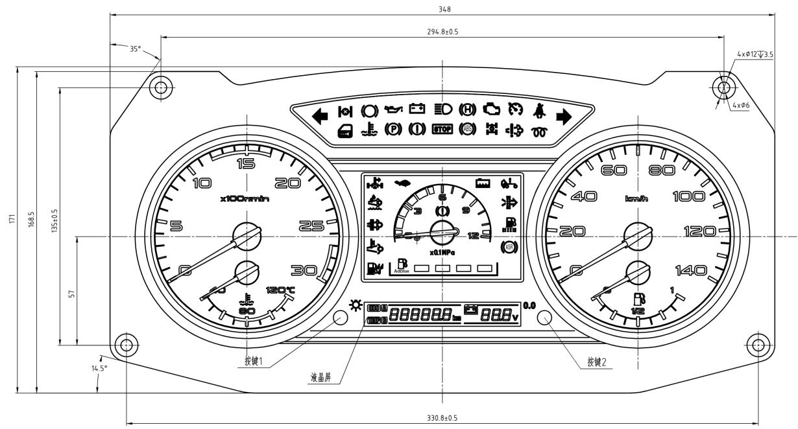

text_image

34.8
294.8±0.5
35°
4xφ12√3.5
4xφ6
171 168.5 135±0.5
57
14.5°
330.8±0.5
10 15 20 25 30 35 40 45 50 55 60 65 70 75 80 85 90 95 100 105 110 115 120 125 130 135
x100min x101MPa
按键1 液晶屏
按钮2

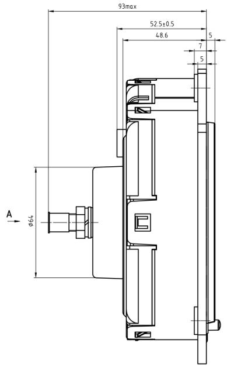

text_image

93max
52.5±0.5
48.6
5
7
5
A
φ64

<table><tr><td colspan="12">机械指针表</td></tr><tr><td rowspan="4">车速表</td><td>指示速度(km/h)</td><td colspan="2">0</td><td>20</td><td colspan="2">40</td><td>60</td><td>80</td><td>100</td><td>120</td><td>(14.0)</td></tr><tr><td>实际速度(km/h)</td><td colspan="2">0</td><td>18.5~21.5</td><td colspan="2">37.5~40</td><td>57.5~60</td><td>77.5~80</td><td>97.5~100</td><td>117~120</td><td>——</td></tr><tr><td>基准频率(Hz)</td><td colspan="2">0</td><td>27.7</td><td colspan="2">55.5</td><td>83.2</td><td>111</td><td>138.7</td><td>166.4</td><td>——</td></tr><tr><td colspan="11">每公里脉冲数4992(1:624,传感器8脉冲)</td></tr><tr><td rowspan="3">转速表</td><td>指示转速(r/min)</td><td colspan="2">0</td><td colspan="2">500</td><td>1000</td><td>1500</td><td>2000</td><td colspan="2">2500</td><td>3000</td></tr><tr><td>输入信号</td><td colspan="10">CAN数据</td></tr><tr><td>允许误差</td><td colspan="10">±50r/min</td></tr><tr><td rowspan="3">燃油表</td><td>指示刻度值</td><td colspan="4">0</td><td colspan="3">1/2</td><td colspan="3">1</td></tr><tr><td>基准阻值(Ω)</td><td colspan="4">107</td><td colspan="3">38</td><td colspan="3">8</td></tr><tr><td>允许误差</td><td colspan="10">±3Ω</td></tr><tr><td rowspan="6">水温表</td><td>指示刻度值(°C)</td><td colspan="2">40</td><td colspan="2">(60)</td><td colspan="2">80</td><td colspan="2">(100)</td><td colspan="2">120</td></tr><tr><td>输入信号</td><td colspan="10">CAN数据</td></tr><tr><td>允许误差</td><td colspan="10">±2°C</td></tr><tr><td rowspan="3" colspan="2"></td><td colspan="9">冷却液温度≥40°C且&lt;90°C时:按实际温度值正常指示</td></tr><tr><td colspan="9">冷却液温度≥90°C且&lt;105°C之间时:指针始终指向90°C位置</td></tr><tr><td colspan="9">冷却液温度≥105°C且&lt;120°C之间时:按实际温度值正常指示</td></tr><tr><td rowspan="2">机械式气压表</td><td>指示刻度值(X0.1MPa)</td><td colspan="2">0</td><td colspan="2">3</td><td colspan="2">6</td><td colspan="2">9</td><td colspan="2">12</td></tr><tr><td>允许误差</td><td colspan="10">±0.03MPa</td></tr><tr><td rowspan="7">尿素液位</td><td>指示灯点亮状态(绿色)</td><td colspan="2">无</td><td colspan="2">LED1</td><td colspan="2">LED1~LED2</td><td colspan="2">LED1~LED3</td><td colspan="2">LED1~LED4</td></tr><tr><td>尿素液位值(下行,熄灭)</td><td>0%15%35%55%75%</td><td>0%15%35%55%75%</td><td>0%15%35%55%75%</td><td>0%15%35%55%75%</td><td>0%15%35%55%75%</td><td>0%15%35%55%75%</td><td>0%15%35%55%75%</td><td>0%15%35%</td><td>0%15%35%</td><td>0%15%35%</td></tr><tr><td>尿素液位值(上行,点亮)</td><td>0%≤L&lt;25%</td><td>25%≤L&lt;45%</td><td>45%≤L&lt;65%</td><td>65%≤L&lt;85%</td><td>85%≤L&lt;100%</td><td>0%≤L&lt;25%</td><td>25%≤L&lt;45%</td><td>45%≤L&lt;65%</td><td>65%≤L&lt;85%</td><td>85%≤L&lt;100%</td></tr><tr><td>允许误差</td><td colspan="10">±2%</td></tr><tr><td colspan="11">自动识别尿素液位信号。当未识别到时,尿素液位符号及状态指示灯均不点亮;</td></tr><tr><td colspan="11">当识别到尿素液位信号时,尿素液位符号点亮(绿色),状态指示灯根据表中定义点亮。</td></tr><tr><td colspan="11">当识别到尿素液位、且LED全部熄灭时,尿素液位符号变为黄色,并以1Hz的频率闪烁。</td></tr></table>

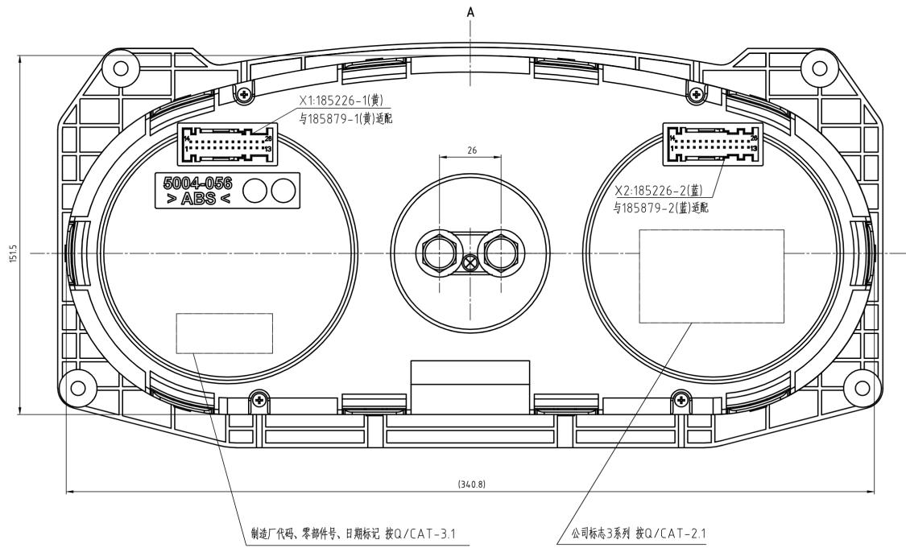

text_image

X1:185226-1(黄)
与185879-1(黄)适配
5004-056
>ABS<
26
X2:185226-2(蓝)
与185879-2(蓝)适配
(340.8)
制造厂代码、零部件号、日期标记 按Q/CAT-3.1
公司标志3系列 按Q/CAT-2.1

液晶屏显示内容

<table><tr><td>里程信息</td><td>分为小计里程(TRIPA)、小计里程(TRIPB)和总里程(ODO)。点按按键2,可在两者间切换。小计里程分辨率为0.1km,可在达到99999.9km后自动清零,或通过长按按键2手动清零。总里程分辨率为1km,最大显示999999km,不可自动或手动清零。</td></tr><tr><td>电压信息</td><td>显示电压数值,精度0.5V,当蓄电池电压&lt;22V或&gt;30V时,液晶显示的蓄电池电压标志以1Hz的频率闪烁。</td></tr></table>

按键功能

<table><tr><td>按键1</td><td>长按按键1,调节仪表背光亮度。共五档调节,默认第二档,通过点按按键1实现亮度调节。</td></tr><tr><td>按键2</td><td>点按按键2,切换小计里程和总里程;长按按键2,小计里程清零。</td></tr></table>

<table><tr><td>序号</td><td>符号</td><td>显示颜色</td><td>标志意义</td></tr><tr><td>1</td><td>STOP</td><td>红色</td><td>STOP故障指示</td></tr><tr><td>2</td><td>(P)</td><td>红色</td><td>驻车制动指示</td></tr><tr><td>3</td><td>(H)</td><td>黄色</td><td>辅助制动指示</td></tr><tr><td>4</td><td>(I)</td><td>红色</td><td>制动系统故障警报</td></tr><tr><td>5</td><td>OO</td><td>黄色</td><td>发动机预热</td></tr><tr><td>6</td><td>(○)</td><td>蓝色</td><td>远光指示</td></tr><tr><td>7</td><td></td><td>绿色</td><td>右转向指示</td></tr><tr><td>8</td><td></td><td>绿色</td><td>左转向指示</td></tr><tr><td>9</td><td></td><td>黄色</td><td>DPF再生状态指示</td></tr><tr><td>10</td><td></td><td>黄色</td><td>DPF碳载量指示</td></tr><tr><td>11</td><td></td><td>红色</td><td>蓄电池充电指示</td></tr><tr><td>12</td><td></td><td>红色</td><td>油压警报</td></tr><tr><td>13</td><td></td><td>红色</td><td>冷却液温度警报</td></tr><tr><td>14</td><td>(K)</td><td>黄色</td><td>ABS1(上车)警报</td></tr><tr><td>15</td><td></td><td>黄色</td><td>驾驶员提醒指示</td></tr><tr><td>16</td><td></td><td>黄色</td><td>排放故障警报</td></tr><tr><td>17</td><td></td><td>黄色</td><td>发动机故障指示</td></tr><tr><td>18</td><td></td><td>绿色</td><td>巡航指示</td></tr><tr><td>19</td><td></td><td>红色</td><td>油水分离警报</td></tr><tr><td>20</td><td></td><td>红色</td><td>车门报警指示</td></tr></table>

<table><tr><td>序号</td><td>符号</td><td>显示颜色</td><td>标志意义</td></tr><tr><td>21</td><td></td><td>红色</td><td>燃糊堵塞警报</td></tr><tr><td>22</td><td></td><td>红色</td><td>空滤器堵塞警报</td></tr><tr><td>23</td><td></td><td>黄色</td><td>低漆档指示</td></tr><tr><td>24</td><td></td><td>黄色</td><td>取力器指示</td></tr><tr><td>25</td><td></td><td>黄色</td><td>ASR指示</td></tr><tr><td>26</td><td></td><td>黄色</td><td>轮间差速器指示</td></tr><tr><td>27</td><td></td><td>黄色</td><td>轴间差速器指示</td></tr><tr><td>28</td><td></td><td>红色</td><td>冷却液位警报</td></tr><tr><td>29</td><td></td><td>红色</td><td>驾驶室翻转警报</td></tr><tr><td>30</td><td></td><td>红色</td><td>安全带未系警报</td></tr><tr><td>31</td><td></td><td>红色</td><td>制动跑片磨损警报</td></tr><tr><td>32</td><td></td><td>绿色</td><td>尿素液位指示</td></tr><tr><td>33</td><td></td><td>黄色</td><td>尿素液位过低警报</td></tr></table>

未注公差见JF03-100

仪表屏板和仪表标度盘底色为消光黑色，各标度盘采用透光式照明且仪表整体照明应均匀、柔和，面板应清晰透明，无折光、划痕

分度线、字符及各信号标志为白色；按键标识为白色，字体为Arial粗体；指针为红色，针帽为黑色；屏圈为黑色，喷消光塑漆

液晶屏为VTN型段码屏

仪表背光照明为白色，亮度可手动和自动调整

仪表在接收到上装举升信号时能够蜂鸣提醒，装车后驾驶员人耳处的声音在70dB以上

发动机转速输入信号、水温输入信号、油压输入信号、辅助制动信号、巡航控制信号、尿素液位信号从ECU通过CAN通讯实现传输

车速输出信号（给ECU）从仪表通过CAN通讯实现传输

发动机经济转速区（绿色区域）为1200r/min\~1700r/min，危险转速区（红色区域）为2700r/min\~最大指示转速

水温表警报温度为(105\~107)℃

电磁兼容性（EMC）技术条件按JA3700-93C-1

其他技术条件按JA3820-A01-1

开始供应前，样品须经产品设计部门复验

<table><tr><td colspan="3">X1:185226-1(黄)</td></tr><tr><td>管脚序号</td><td>功能说明</td><td>信号特征</td></tr><tr><td>X1:1</td><td>排放故障警报-</td><td>低电平</td></tr><tr><td>X1:2</td><td>发动机预热指示+</td><td>高电平</td></tr><tr><td>X1:3</td><td>发动机预热指示-</td><td>低电平</td></tr><tr><td>X1:4</td><td>排放故障警报+</td><td>高电平</td></tr><tr><td>X1:5</td><td>制动跨片磨损警报</td><td>高电平或悬空有效</td></tr><tr><td>X1:6</td><td>预留</td><td></td></tr><tr><td>X1:7</td><td>远光灯指示</td><td>高电平</td></tr><tr><td>X1:8</td><td>上装举升蜂鸣器警报</td><td>低电平</td></tr><tr><td>X1:9</td><td>预留</td><td></td></tr><tr><td>X1:10</td><td>电源输出(车速传感器)</td><td>12V(40mA)</td></tr><tr><td>X1:11</td><td>电源输出(气压传感器)</td><td>5V(60mA)</td></tr><tr><td>X1:12</td><td>电源(ON档)</td><td></td></tr><tr><td>X1:13</td><td>电源(蓄电池)</td><td></td></tr><tr><td>X1:14</td><td>右转向指示</td><td>高电平</td></tr><tr><td>X1:15</td><td>左转向指示</td><td>高电平</td></tr><tr><td>X1:16</td><td></td><td>高电平</td></tr><tr><td>X1:17</td><td></td><td>高电平</td></tr><tr><td>X1:18</td><td>驾驶室翻转警报</td><td>低电平</td></tr><tr><td>X1:19</td><td>预留</td><td></td></tr><tr><td>X1:20</td><td></td><td>低电平</td></tr><tr><td>X1:21</td><td>搭铁(气压传感器)</td><td></td></tr><tr><td>X1:22</td><td>电源(仪表照明)</td><td></td></tr><tr><td>X1:23</td><td>预留</td><td></td></tr><tr><td>X1:24</td><td>CAN-H(H)</td><td>250kbps</td></tr><tr><td>X1:25</td><td>CAN-L(H)</td><td>250kbps</td></tr><tr><td>X1:26</td><td>搭铁(仪表)</td><td></td></tr><tr><td colspan="3">X2:185226-2(蓝)</td></tr><tr><td>管脚序号</td><td>功能说明</td><td>信号特征</td></tr><tr><td>X2:1</td><td>蓄电池充电指示</td><td>低电平</td></tr><tr><td>X2:2</td><td>冷却液液位警报</td><td>冷却液位低时,持续8秒后点亮</td></tr><tr><td>X2:3</td><td>驻车制动指示</td><td>低电平</td></tr><tr><td>X2:4</td><td>轮间差速器指示</td><td>低电平</td></tr><tr><td>X2:5</td><td>安全带未系警报</td><td>低电平</td></tr><tr><td>X2:6</td><td>发动机故障警报-(黄色)</td><td>低电平</td></tr><tr><td>X2:7</td><td>燃油滤清器堵塞警报</td><td>低电平</td></tr><tr><td>X2:8</td><td>发动机故障警报+(黄色)</td><td>高电平</td></tr><tr><td>X2:9</td><td>车速表信号输入</td><td></td></tr><tr><td>X2:10</td><td>预留</td><td></td></tr><tr><td>X2:11</td><td>室外温度信号输入</td><td></td></tr><tr><td>X2:12</td><td>燃油表信号输入</td><td></td></tr><tr><td>X2:13</td><td>预留</td><td></td></tr><tr><td>X2:14</td><td>轴间差速器指示</td><td>低电平</td></tr><tr><td>X2:15</td><td>ABS1(主车)指示</td><td>低电平</td></tr><tr><td>X2:16</td><td>油水分离警报</td><td>低电平</td></tr><tr><td>X2:17</td><td>ASR警报</td><td>低电平</td></tr><tr><td>X2:18</td><td>取力器工作指示</td><td>低电平</td></tr><tr><td>X2:19</td><td>制动系统故障警报</td><td>低电平</td></tr><tr><td>X2:20</td><td>空气滤清器堵塞警报</td><td>低电平</td></tr><tr><td>X2:21</td><td>低速档指示</td><td>低电平</td></tr><tr><td>X2:22</td><td>车门警报</td><td>低电平</td></tr><tr><td>X2:23</td><td>车速表信号输出</td><td>集电极开路</td></tr><tr><td>X2:24</td><td></td><td>低电平</td></tr><tr><td>X2:25</td><td>气压表1信号输入</td><td></td></tr><tr><td>X2:26</td><td>气压表2信号输入</td><td></td></tr></table>

生产准备

<table><tr><td>名称</td><td colspan="10">组合仪表总成</td><td colspan="5">3820010-19T</td></tr><tr><td>设计</td><td>杜洁</td><td colspan="2">保安重要</td><td></td><td>项数</td><td></td><td>加工方法</td><td></td><td>御件版本</td><td>A</td><td>文档版本</td><td>A</td><td>图幅</td><td>A0</td><td>共 1 张 第 1 张</td></tr><tr><td>校对</td><td>苏朋军</td><td colspan="2">产品鉴赏</td><td>Y</td><td>非金属</td><td>N</td><td>花纹</td><td>N</td><td>颜色</td><td>Y</td><td>图纸类别</td><td>P</td><td>比例</td><td>1:1</td><td rowspan="2"></td></tr><tr><td>审核</td><td>苏朋军</td><td colspan="2">重量</td><td>1.2</td><td>kg</td><td colspan="2">热处理</td><td>N</td><td>表面防护</td><td>N</td><td>绘图软件</td><td colspan="3">AutoCAD</td></tr><tr><td>总布置</td><td>刘全胜</td><td rowspan="4">材料</td><td rowspan="4" colspan="8"></td><td colspan="5">变更通告号CA1251PG2K1L7T3E5S100001_07</td></tr><tr><td>标准化</td><td>王伟</td><td rowspan="2">影响互换</td><td rowspan="2">标记</td><td rowspan="2">○夹数</td><td rowspan="2">日期</td><td rowspan="2">20180528</td></tr><tr><td>会签</td><td></td></tr><tr><td>批准</td><td>苏朋军</td><td colspan="5">中国一汽技术中心</td></tr></table>

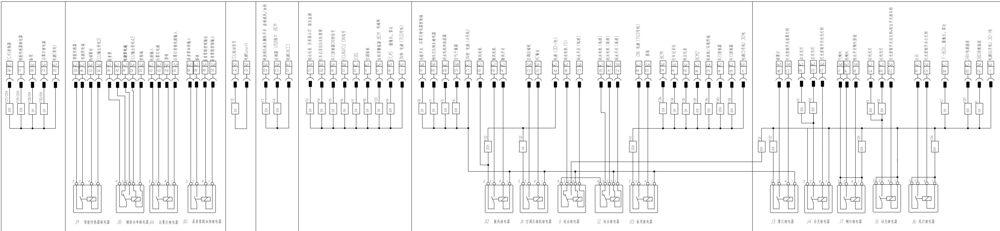

flowchart

```mermaid
graph TD
    subgraph Power Circuit
        A1["ECU起动信号"] --> B1["电源(ACO)"]
        A2["ECU启动信号"] --> B2["电源(ACO)"]
        A3["ECU启动信号"] --> B3["电源(ACO)"]
        A4["ECU启动信号"] --> B4["电源(ACO)"]
        A5["ECU启动信号"] --> B5["电源(ACO)"]
        A6["ECU启动信号"] --> B6["电源(ACO)"]
        A7["ECU启动信号"] --> B7["电源(ACO)"]
        A8["ECU启动信号"] --> B8["电源(ACO)"]
        A9["ECU启动信号"] --> B9["电源(ACO)"]
        A10["ECU启动信号"] --> B10["电源(ACO)"]
        A11["ECU启动信号"] --> B11["电源(ACO)"]
        A12["ECU启动信号"] --> B12["电源(ACO)"]
        A13["ECU启动信号"] --> B13["电源(ACO)"]
        A14["ECU启动信号"] --> B14["电源(ACO)"]
        A15["ECU启动信号"] --> B15["电源(ACO)"]
        A16["ECU启动信号"] --> B16["电源(ACO)"]
        A17["ECU启动信号"] --> B17["电源(ACO)"]
        A18["ECU启动信号"] --> B18["电源(ACO)"]
        A19["ECU启动信号"] --> B19["电源(ACO)"]
        A20["ECU启动信号"] --> B20["电源(ACO)"]
        A21["ECU启动信号"] --> B21["电源(ACO)"]
        A22["ECU启动信号"] --> B22["电源(ACO)"]
        A23["ECU启动信号"] --> B23["电源(ACO)"]
        A24["ECU启动信号"] --> B24["电源(ACO)"]
        A25["ECU启动信号"] --> B25["电源(ACO)"]
        A26["ECU启动信号"] --> B26["电源(ACO)"]
        A27["ECU启动信号"] --> B27["电源(ACO)"]
        A28["ECU启动信号"] --> B28["电源(ACO)"]
        A29["ECU启动信号"] --> B29["电源(ACO)"]
        A30["ECU启动信号"] --> B30["电源(ACO)"]
        A31["ECU启动信号"] --> B31["电源(ACO)"]
        A32["ECU启动信号"] --> B32["电源(ACO)"]
        A33["ECU启动信号"] --> B33["电源(ACO)"]
        A34["ECU启动信号"] --> B34["电源(ACO)"]
        A35["ECU启动信号"] --> B35["电源(ACO)"]
        A36["ECU启动信号"] --> B36["电源(ACO)"]
        A37["ECU启动信号"] --> B37["电源(ACO)"]
        A38["ECU启动信号"] --> B38["电源(ACO)"]
        A39["ECU启动信号"] --> B39["电源(ACO)"]
        A40["ECU启动信号"] --> B40["电源(ACO)"]
        A41["ECU启动信号"] --> B41["电源(ACO)"]
        A42["ECU启动信号"] --> B42["电源(ACO)"]
        A43["ECU启动信号"] --> B43["电源(ACO)"]
        A44["ECU启动信号"] --> B44["电源(ACO)"]
        A45["ECU启动信号"] --> B45["电源(ACO)"]
        A46["ECU启动信号"] --> B46["电源(ACO)"]
        A47["ECU启动信号"] --> B47["电源(ACO)"]
        A48["ECU启动信号"] --> B48["电源(ACO)"]
        A49["ECU启动信号"] --> B49["电源(ACO)"]
        A50["ECU启动信号"] --> B50["电源(ACO)"]
        A51["ECU启动信号"] --> B51["电源(ACO)"]
        A52["ECU启动信号"] --> B52["电源(ACO)"]
        A53["ECU启动信号"] --> B53["电源(ACO)"]
        A54["ECU启动信号"] --> B54["电源(ACO)"]
        A55["ECU启动信号"] --> B55["电源(ACO)"]
        A56["ECU启动信号"] --> B56["电源(ACO)"]
        A57["ECU启动信号"] --> B57["电源(ACO)"]
        A58["ECU启动信号"] --> B58["电源(ACO)"]
        A59["ECU启动信号"] --> B59["电源(ACO)"]
        A60["ECU启动信号"] --> B60["电源(ACO)"]
        A61["ECU启动信号"] --> B61["电源(ACO)"]
        A62["ECU启动信号"] --> B62["电源(ACO)"]
        A63["ECU启动信号"] --> B63["电源(ACO)"]
        A64["ECU启动信号"] --> B64["电源(ACO)"]
        A65["ECU启动信号"] --> B65["电源(ACO)"]
        A66["ECU启动信号"] --> B66["电源(ACO)"]
        A67["ECU启动信号"] --> B67["电源(ACO)"]
        A68["ECU启动信号"] --> B68["电源(ACO)"]
        A69["ECU启动信号"] --> B69["电源(ACO)"]
        A70["ECU启动信号"] --> B70["电源(ACO)"]
        A71["ECU启动信号"] --> B71["电源(ACO)"]
        A72["ECU启动信号"] --> B72["电源(ACO)"]
        A73["ECU启动信号"] --> B73["电源(ACO)"]
        A74["ECU启动信号"] --> B74["电源(ACO)"]
        A75["ECU启动信号"] --> B75["电源(ACO)"]
        A76["ECU启动信号"] --> B76["电源(ACO)"]
        A77["ECU启动信号"] --> B77["电源(ACO)"]
        A78["ECU启动信号"] --> B78["电源(ACO)"]
        A79["ECU启动信号"] --> B79["电源(ACO)"]
        A80["ECU启动信号"] --> B80["电源(ACO)"]
        A81["ECU启动信号"] --> B81["电源(ACO)"]
        A82["ECU启动信号"] --> B82["电源(ACO)"]
        A83["ECU启动信号"] --> B83["电源(ACO)"]
        A84["ECU启动信号"] --> B84["电源(ACO)"]
        A85["ECU启动信号"] --> B85["电源(ACO)"]
        A86["ECU启动信号"] --> B86["电源(ACO)"]
        A87["ECU启动信号"] --> B87["电源(ACO)"]
        A88["ECU启动信号"] --> B88["电源(ACO)"]
        A89["ECU启动信号"] --> B89["电源(ACO)"]
        A90["ECU启动信号"] --> B90["电源(ACO)"]
```

本体 共40路保险丝 14个继电器

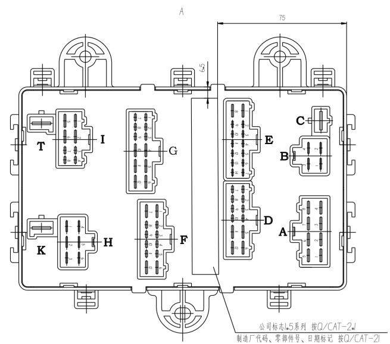

text_image

公司标志-5系列 按O/CAT-2
制造厂代码、零部件号、日期标记 按O/CAT-2

<table><tr><td>序号</td><td>位置</td><td>线束侧插接件型号</td></tr><tr><td>1</td><td>A</td><td>080202060</td></tr><tr><td>2</td><td>B</td><td>040102060</td></tr><tr><td>3</td><td>C</td><td>010302094</td></tr><tr><td>4</td><td>D</td><td>1203023/69</td></tr><tr><td>5</td><td>F</td><td>1401023/69</td></tr><tr><td>6</td><td>F</td><td>1202023/69</td></tr><tr><td>7</td><td>G</td><td>1201023/69</td></tr><tr><td>8</td><td>H</td><td>060202060</td></tr><tr><td>9</td><td>I</td><td>0801023/69</td></tr><tr><td>10</td><td>K</td><td>010502092</td></tr><tr><td>11</td><td>T</td><td>010402091</td></tr></table>

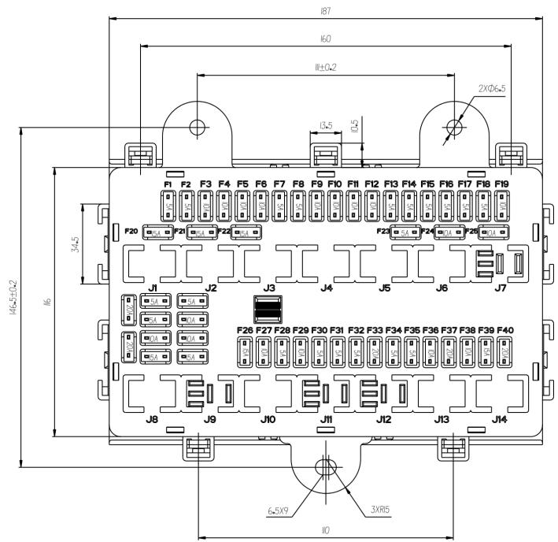

text_image

187
160
Ⅲ±0.2
2XØ6.5
13.5
10.5
F1 F2 F3 F4 F5 F6 F7 F8 F9 F10 F11 F12 F13 F14 F15 F16 F17 F18 F19
F20 F21 F22
F23 5A 24 25
J1 J2 J3 J4 J5 J6 J7
F26 F27 F28 F29 F30 F31 F32 F33 F34 F35 F36 F37 F38 F39 F40
J8 J9 J10 J11 J12 J13 J14
6.5x9
3XR5
10

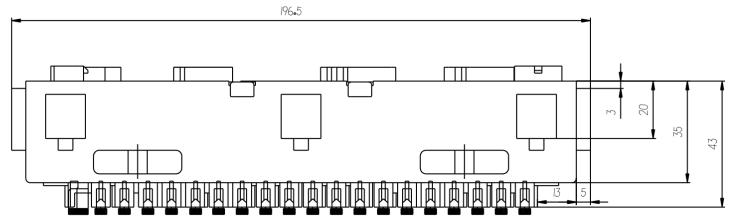

text_image

R6.5
3
20
35
4.3
18
5

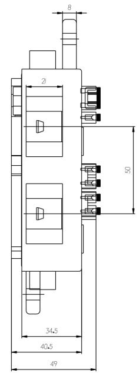

text_image

8
2l
50
34.5
40.5
49

熔断器类型为F型，应符合GB/T 31465.1和GB/T 31465.3要求

本体材料燃烧性能符合GB/T 2408中水平HB级，垂直V-U级要求

振动按照GB/T 28046.5要求其他熔断JA 3722-A01-1更求

熔断器各电路电压降满足以下要求：对于负载≤10A电路，最大压降为20mV/A；对于负载在10A和20A之间，最大压降为15mV/A；对于负载≥20A电路，最大压降为10mV/A

保险丝插拔器颜色为红色

未注圆角见三维数据

主体材料为PA66，按JF03-26

后盖板材料为PP，按JFU3-36（b）

保险丝监贴你签，共令许与应清晰，粘贴牢固

开始供应前，样品须经产品设计部门复验

生产准备

<table><tr><td colspan="2">名称</td><td colspan="9">驾墩宝熔断器盘总成(式样图)</td><td colspan="5">3722010B19T</td></tr><tr><td>设计</td><td></td><td rowspan="3"></td><td>保安要领</td><td>I</td><td>填数</td><td>I</td><td>加工方法</td><td></td><td>部件版本</td><td></td><td>文明版本</td><td>A</td><td>图纸</td><td>AO</td><td>共2盘落1盘</td></tr><tr><td>校对</td><td>魏晓萍</td><td>产品包装</td><td>Y</td><td>非金属</td><td>N</td><td>毛纹</td><td>N</td><td>颜色</td><td>B4N</td><td>图纸类别</td><td>P</td><td>比例</td><td>[1]</td><td></td></tr><tr><td>审核</td><td>任端龙</td><td>重量</td><td colspan="3">C46kg</td><td>热处理</td><td>N</td><td>表面防护</td><td>N</td><td>地图胶带</td><td colspan="3">CATIA V5</td><td></td></tr><tr><td>总布置</td><td>贾文勇</td><td rowspan="4" colspan="2">材料</td><td rowspan="3" colspan="7"></td><td>变更通风车</td><td colspan="4"></td></tr><tr><td>标准化</td><td>李松</td><td>玉静性</td><td>木材</td><td>振动机</td><td>∅∅规格</td><td>0.01日图</td></tr><tr><td>合签</td><td>王伟</td><td rowspan="2" colspan="5">一汽解放汽车有限公司商用车开发院</td></tr><tr><td>批准</td><td>李国辉</td><td colspan="2">代码</td><td colspan="5">material code</td></tr></table>

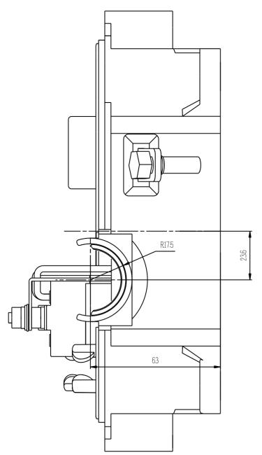

text_image

R75
236
63

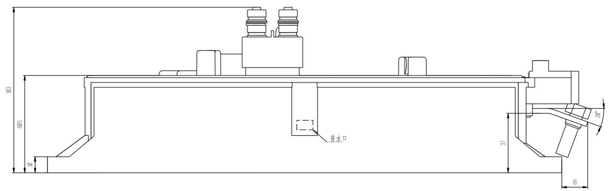

text_image

183
905
98
排水口
37
28°
16

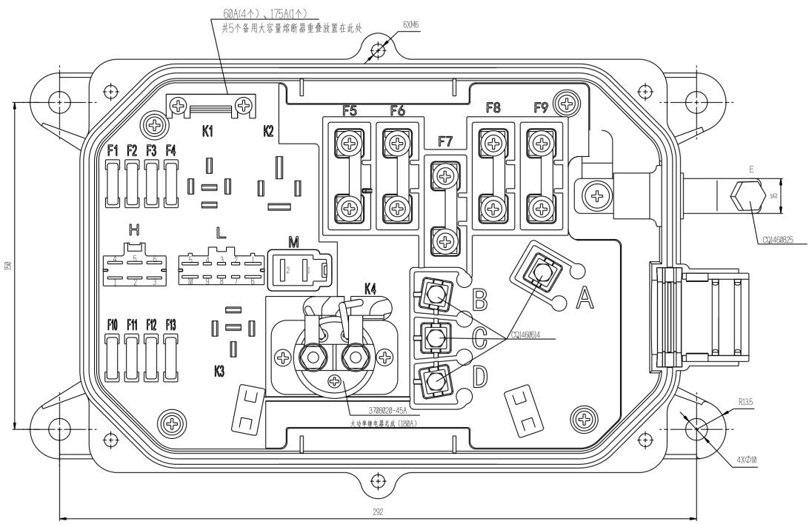

text_image

60A(4个)、175A(1个)
共5个备用大容量熔断器重叠放置在此处
6XM6
F1 F2 F3 F4
K1 K2
F5 F6
F7
F8 F9
H L M
E
M
F0 F1 F2 F3
K3
B C Q1468614
D
3780820-45A
大功率继电器总成(10mA)
R135
4X210
292

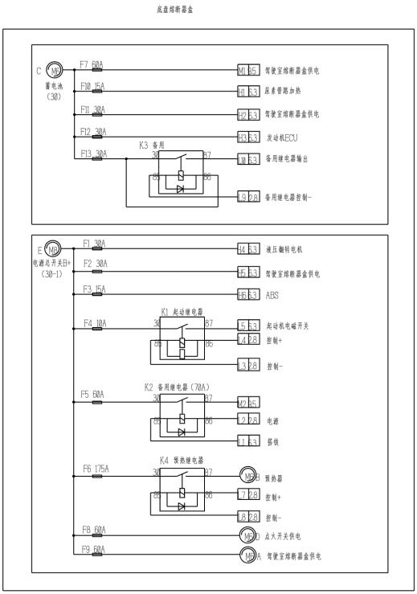

flowchart

```mermaid
graph TD
    subgraph 底盘熔断器盒
        C["蓄电池 (30)"]
        F7["F7 60A"] --> K3["备用"]
        F8["F8 50A"] --> K3
        F11["F11 20A"] --> K3
        F12["F12 20A"] --> K3
        F13["F13 20A"] --> K3
        K3 --> K4["备用"]
        K4 --> K5["变压器"]
        K5 --> K6["发电机"]
        K6 --> K7["电感"]
        K7 --> K8["电源"]
        K8 --> K9["控制"]
        K9 --> K10["开关"]
    end

    subgraph 电源开关 (30-1)
        E["电源开关 (30-1)"]
        F1["F1 20A"] --> K1["起动继电器"]
        F2["F2 20A"] --> K1
        F3["F3 50A"] --> K1
        F4["F4 10A"] --> K1
        F5["F5 60A"] --> K1
        K1 --> K2["备用继电器 (70A)"]
        K2 --> K4["预热继电器"]
        K4 --> K5["电源"]
        K5 --> K6["控制"]
        K6 --> K7["开关"]
        K7 --> K8["电源"]
        K8 --> K9["控制"]
    end

    subgraph 驱驶室熔断器盒供电
        C --> F7
        F7 --> F8
        F8 --> F11
        F11 --> F12
        F12 --> F13
        F13 --> F14
        F14 --> F15
        F15 --> F16
        F16 --> F17
        F17 --> F18
        F18 --> F19
        F19 --> F20
        F20 --> F21
        F21 --> F22
        F22 --> F23
        F23 --> F24
        F24 --> F25
        F25 --> F26
        F26 --> F27
        F27 --> F28
        F28 --> F29
        F29 --> F30
        F30 --> F31
        F31 --> F32
        F32 --> F33
        F33 --> F34
        F34 --> F35
        F35 --> F36
        F36 --> F37
        F37 --> F38
        F38 --> F39
        F39 --> F40
        F40 --> F41
        F41 --> F42
        F42 --> F43
        F43 --> F44
        F44 --> F45
        F45 --> F46
        F46 --> F47
        F47 --> F48
        F48 --> F49
        F49 --> F50
    end

    subgraph 反馈管路加热
        C -->|DC| A
        C -->|DC| B
        C -->|DC| C
    end

    subgraph 发动机ECU
        C -->|DC| D
        C -->|DC| E
        C -->|DC| E
    end

    subgraph 备用继电器输出
        C -->|DC| G
        C -->|DC| H
    end

    subgraph 备用继电器控制-
        C -->|DC| I
        C -->|DC| J
    end

    subgraph 烧压触锁电机
        E -->|DC| K
    end

    subgraph 驱驶室熔断器盒供电
        E -->|DC| L
    end

    subgraph ABS
        E -->|DC| M
    end

    subgraph 起动机电磁开关
        E -->|DC| N
    end

    subgraph 控制+
        E -->|DC| O
    end

    subgraph 控制-
        E -->|DC| P
    end

    subgraph 电源
        E -->|DC| Q
    end

    subgraph 预热器
        E -->|DC| R
    end

    subgraph 控制+
        E -->|DC| S
    end

    subgraph 控制-
        E -->|DC| T
    end

    subgraph 点火开关供电
        E -->|DC| U
    end
```

<table><tr><td>序号</td><td>位置</td><td>电线束端适配插接器型号</td><td>备注</td></tr><tr><td>1</td><td>H</td><td>060202060</td><td></td></tr><tr><td>2</td><td>L</td><td>1002023/69</td><td></td></tr><tr><td>3</td><td>M</td><td>020101090</td><td></td></tr></table>

盒体采用PA6-GF20，材料规格标准按JF03-26

盒体内需贴有注明零部件号的标签，零部件号按Q/CAT-3.1

10A片式熔断器采用3722012-50

20A片式熔断器采用3722014-56

15A片式熔断器采用3722013-50

30A片式熔断器采用3722017-50

继电器插座应符合3711030-240、3722110-671继电器安装要求

插接器按QC/T 417

背面接线柱采用铜板连接，铜板用热缩管包裹

导线均用聚氯乙烯薄壁导线，按GB/T 25085 B级

防水圈使用透明硅胶，硬度邵氏40+5，耐温不低于-40℃\~135℃

接线柱A、B、C、D螺栓扭紧力矩为（5～7）N·m，接线柱F螺栓扭紧力矩为（10～12）N·m

本体材料燃烧性能符合GB/T 2408中水平HR级。垂直V-0级要求

振动按照GB/T 280463要求

其他按照 IA3722-240-1 要求

开始供应前，样品须经产品设计部门复验

<table><tr><td colspan="2">名称</td><td colspan="8">底盘熔断器盘总成(式样图)</td><td colspan="5">3722150-16N-C00</td></tr><tr><td>设计</td><td></td><td colspan="2">保守重质</td><td colspan="2">伸展</td><td colspan="2">加工方法</td><td colspan="2">取样版本</td><td>文明版本</td><td>A</td><td>图纸</td><td>A1</td><td>共2张第1套</td></tr><tr><td>校对</td><td>魏晓萍</td><td colspan="2">产品集锦</td><td>Y</td><td>非金属</td><td>N</td><td>花线</td><td>N</td><td>颜色</td><td>R/N</td><td>图纸表现</td><td>P</td><td>比例</td><td>1:1</td></tr><tr><td>审核</td><td>任瑞龙</td><td colspan="2">重量</td><td colspan="2">2.4 kg</td><td colspan="2">熟处理</td><td>N</td><td>表面防护</td><td>N</td><td>绘图部件</td><td colspan="3">CATIA V5</td></tr><tr><td>总布置</td><td colspan="2">贾文勇</td><td rowspan="4">材料</td><td rowspan="4" colspan="7"></td><td colspan="4">变更通合号</td></tr><tr><td>标准化</td><td colspan="2">李松</td><td>见附件</td><td>K本</td><td colspan="2">按启动I2冲撤量,01日图</td></tr><tr><td>企型</td><td colspan="2">王伟</td><td rowspan="2" colspan="4">一汽解放汽车有限公司商用车开发院</td></tr><tr><td>批准</td><td colspan="2">李国辉</td></tr></table>

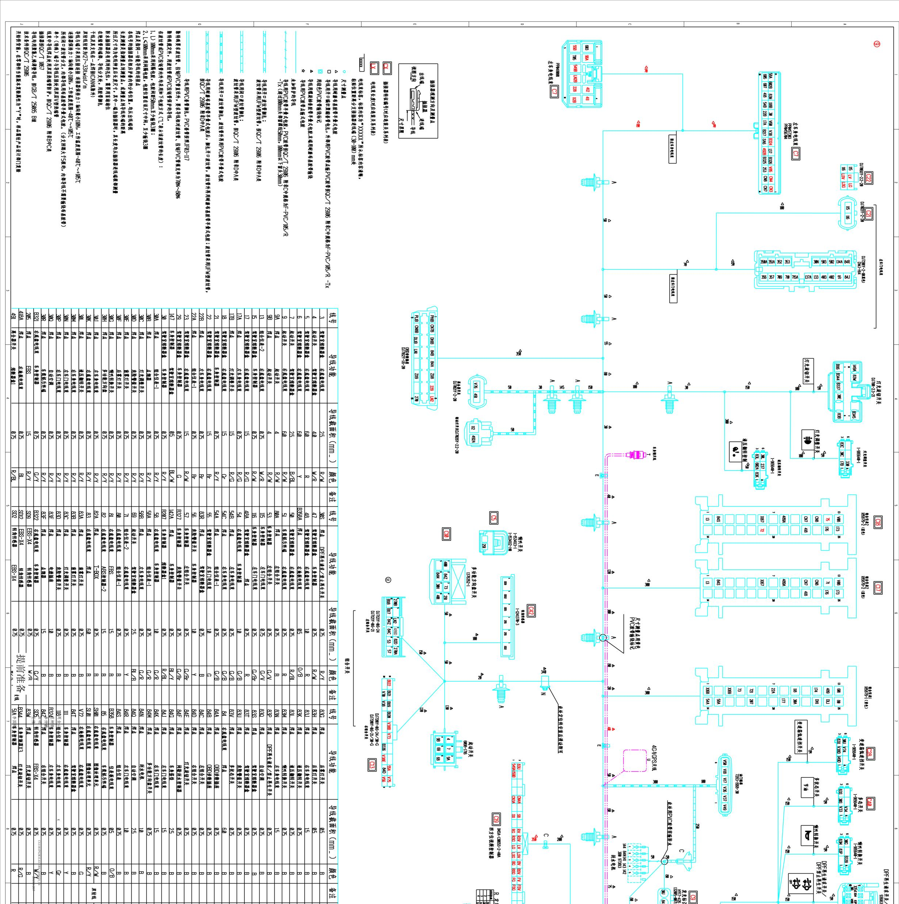

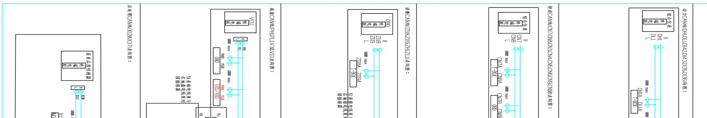

text_image

VCCU
回电
VCCU
回电
VCCU
回电
VCCU
回电
VCCU
回电
VCCU
回电
VCCU
回电
VCCU
回电
VCCU
回电
VCCU
回电
VCCU
回电
VCCU
回电
VCCU
回电
VCCU
回电
VCCU
回电
VSS/ARS
回电
VSS/ARS
回电
VSS/ARS
回电
VSS/ARS
回电
VSS/ARS
回电
VSS/ARS
回电
VSS/ARS
回电
VSS/ARS
回电
VSS/ARS
回电
VSS/ARS
回电
VSS/ARS
回电
VSS/ARS
回电
VSS/ARS
回电

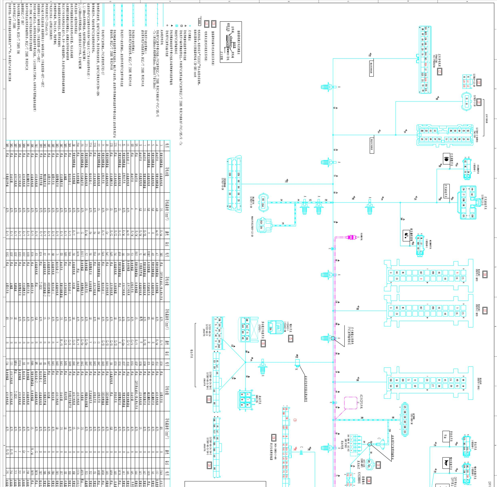

架特维要求激放管、拉链PVC管直径外，要求导线和内激放管、拉链PVC管填充率为70%\~80%。梁特强度外，而激放管或PVC管链路管保护的导线，在波纹管或PVC管铅管内外采用如下高低程方式（T=“表示该激放管的长度”）：L、L100mm采用间隔包成，包间距250mm至3mm；螺栓3：各线导线连接器在相应操作时的分布包位置，均从出线端程长度测量是指测量点到测量点，或测量点到导线终端的距离。所定尺寸均为电线直后长度度寸，其中一端为连接器时，其长度均从连接器进线端部测量防水插座器没有用的孔位，需要用首端住在接缝管的端部、导线分支外，用胶带插孔干线及其支线在一点焊接(CAN线路外)双绞线距离为VZ～33tWIS/m所有闭口纹管分，内置导线间布盖板半叠式包胶。（分支回跟大于5服的，内部导线不需要螺栓布盖板旁）连接器保持力：轴向离小110N，工作温度范围-40℃～+105℃连接器保持力：轴向离小110N，工作温度范围-40℃～+105℃连接器按QC/T 1067导线与用氮乙烯浸穿导线，按GB/T 25005 B级技术条件按QC/T 25005开始保留前，在零卸件号曲版本复填属性为“Y”时，样品需较产品设计部门复修

导线用PVC软带点偏式包轮
X（超过100mm夹箱留线30mm，100mm以下管深30mm）
导线用PVC软带叠式包轮，PVC软带按QC/T 2906附录C中规格为F-PVC/10
X（超过100mm夹箱留线30mm，100mm以下管深30mm）
导线用开口软管插孔；
波纹管采用UPV级波纹管，按QC/T 2906附录D中关
导线用开口软管插孔；
波纹管采用UPV型波纹管，按QC/T 2906附录D中关
导线用开口波纹管插孔，波纹管外用PVC软带叠式包轮
导线用耐磨支载带叠式包轮，插孔开口波纹管，波纹管外用耐磨布菱带背平
导线用耐磨支载带叠式包轮，插孔开口波纹管，按QC/T 2906附录D中关

插接器源测方向及测量点
出线端
接线器
进线端
视图方向
导线
尺寸、屏幕
X
电纸液长度(对应连接关系列表)
电线素标签，标示内容为“XXXX”所示，标示内容清晰，
起脱位置角部分交接插座线端（C5-100）mm外
尺寸测量点
导线用栅布基板带底板
导线用开口栅包隔离管包扎，外脚用PVC散合点锚杆
用绿色PVC放带螺栓标记
包料用栅线技术平面叠力检验半调回相版本基板性能

<table><tr><td>线号</td><td colspan="2">号线功能</td><td>号线截面积(mm2)</td><td>颜色</td><td>备注</td><td>线号</td><td colspan="2">号线功能</td><td>号线截面积(mm2)</td><td>颜色</td><td>备注</td><td>线号</td><td colspan="2">号线功能</td><td>号线截面积(mm2)</td><td>颜色</td><td>备注</td><td>线号</td><td></td></tr><tr><td>3</td><td>寝室宝熔断器盒</td><td>右底盘电线束</td><td></td><td>25</td><td>R/M</td><td></td><td>3RS</td><td>焊点</td><td>DFP再生床床/禁止再生开关</td><td>0.75</td><td>R/V</td><td></td><td>83U</td><td>焊点</td><td>后塞打开关</td><td>0.5</td><td>B</td><td>154A</td><td>左车口</td></tr><tr><td>4</td><td>起动开关</td><td>寝室宝熔断器盒</td><td>4.0</td><td>4.0</td><td>M/R</td><td></td><td>47</td><td>驾驶室熔断器盒</td><td>车身控制器</td><td>0.75</td><td>R/NV</td><td></td><td>83U</td><td>焊点</td><td>右车身电线束</td><td>0.75</td><td>B</td><td>137</td><td>车身制衡器</td></tr><tr><td>5</td><td>寝室宝熔断器盒</td><td>右底盘电线束</td><td>5.0</td><td>R</td><td>4B</td><td></td><td>霞家宝熔断器盒</td><td>右底盘电线束</td><td>1.0</td><td>R</td><td></td><td></td><td>83K</td><td>焊点</td><td>液压螺栓开关</td><td>0.75</td><td>B</td><td>141</td><td>高壁室</td></tr><tr><td>6</td><td>寝室宝熔断器盒</td><td>右底盘电线束</td><td>5.0</td><td>V</td><td>R307</td><td></td><td>车身控制器</td><td></td><td>0.5</td><td>R</td><td></td><td></td><td>83L</td><td>焊点</td><td>液压螺栓开关</td><td>0.75</td><td>B</td><td>141A</td><td>接点</td></tr><tr><td>7</td><td>起动开关</td><td>寝室宝熔断器盒</td><td>25</td><td>R/RU</td><td>50</td><td></td><td>寝室宝熔断器盒</td><td>右底盘电线束</td><td>0.75</td><td>R/RU</td><td></td><td></td><td>83M</td><td>焊点</td><td>喇叭铁丝开关</td><td>0.75</td><td>B</td><td>142</td><td>寝室室</td></tr><tr><td>9</td><td>起动开关</td><td>右底盘电线束</td><td></td><td>5.0</td><td>R/M</td><td></td><td>车身制合终端</td><td>右底盘电线束</td><td>0.75</td><td>R</td><td></td><td></td><td>83N</td><td>焊点</td><td>左车身电线束</td><td>1.5</td><td>B</td><td>143</td><td>高壁室</td></tr><tr><td>QA</td><td>接点</td><td>起动开关</td><td>4</td><td>R/W</td><td>R/D</td><td></td><td>HD2</td><td>驾驶室熔断器盒</td><td>车身控制器</td><td>1.5</td><td>R/V</td><td></td><td>83P</td><td>焊点</td><td>DFP再生床求/禁止再生开关</td><td>0.75</td><td>B</td><td>144</td><td>低壁室</td></tr><tr><td>9B</td><td>接点</td><td>起动开关</td><td>4</td><td>R/W</td><td>53</td><td></td><td>车身控制器</td><td>左组/开关</td><td>0.75</td><td>G/V</td><td></td><td></td><td>83Q</td><td>焊点</td><td>自动空洞</td><td>0.75</td><td>B</td><td>145</td><td>车身栏</td></tr><tr><td>13</td><td>组合仪表-2</td><td>右底盘电线束</td><td>0.75</td><td>W/R</td><td>115</td><td></td><td>车身控制器</td><td>左车门口电线束</td><td>0.75</td><td>G/V</td><td></td><td></td><td>83S</td><td>焊点</td><td>驾驶室熔断器盒</td><td>0.75</td><td>B</td><td>146</td><td>寝室室</td></tr><tr><td>17</td><td>寝室宝熔断器盒</td><td>右底盘电线束</td><td>1.5</td><td>R/G</td><td>116</td><td></td><td>车身控制器</td><td>左车门口电线束</td><td>0.75</td><td>G/Rp</td><td></td><td></td><td>83T</td><td>焊点</td><td>驾驶室熔断器盒</td><td>0.75</td><td>B</td><td>147</td><td>高壁室</td></tr><tr><td>17A</td><td>接点</td><td>左车身电线束</td><td>0.75</td><td>R/G</td><td>54A</td><td></td><td>寝室宝熔断器盒</td><td>焊点</td><td>0.75</td><td>R</td><td></td><td></td><td>83U</td><td>焊点</td><td>危险爆雷开关</td><td>0.75</td><td>B</td><td>147A</td><td>接点</td></tr><tr><td>1TB</td><td>接点</td><td>灯光调断开关</td><td>1.5</td><td>R/G</td><td>54B</td><td></td><td>焊点</td><td>左车身电线束</td><td>0.75</td><td>G/B</td><td></td><td></td><td>83V</td><td>焊点</td><td>多状态开关</td><td>0.75</td><td>B</td><td>148</td><td>车身板</td></tr><tr><td>1B</td><td>寝室宝熔断器盒</td><td>右底盘电线束</td><td>1.5</td><td>GP</td><td>54C</td><td></td><td>焊点</td><td>右车身电线束</td><td>0.75</td><td>G/B</td><td></td><td></td><td>84</td><td>左底盘电线束</td><td>焊点</td><td>6.0</td><td>B</td><td>149A</td><td>接点</td></tr><tr><td>21</td><td>寝室宝熔断器盒</td><td>右组合开关</td><td>0.75</td><td>R/V</td><td>54A</td><td></td><td>焊点</td><td>0.75</td><td>G/B</td><td></td><td></td><td></td><td>84A</td><td>焊点</td><td>OPD涂装插座</td><td>0.75</td><td>B</td><td>149A</td><td>接点</td></tr><tr><td>22</td><td>寝室宝熔断器盒</td><td>右底盘电线束</td><td>1.5</td><td>Rr</td><td>55</td><td></td><td>寝室宝熔断器盒</td><td>车身控制器</td><td>1.0</td><td>G</td><td></td><td></td><td>84B</td><td>焊点</td><td>OPD涂装插座</td><td>0.75</td><td>B</td><td>149B</td><td>接点</td></tr><tr><td>22B</td><td>接点</td><td>左车身电线束</td><td>0.75</td><td>Rp</td><td>55A</td><td></td><td>焊点</td><td>左车门口电线束</td><td>0.75</td><td>G</td><td></td><td></td><td>84C</td><td>焊点</td><td>左组合开关</td><td>0.75</td><td>B</td><td>151</td><td>驾驶员</td></tr><tr><td>22A</td><td>接点</td><td>组合仪表-1</td><td>0.75</td><td>Rp</td><td>56</td><td></td><td>危险爆雷开关</td><td>车身控制器</td><td>1.0</td><td>V</td><td></td><td></td><td>84D</td><td>焊点</td><td>左组/开关</td><td>0.75</td><td>B</td><td>152</td><td>驾驶员</td></tr><tr><td>23</td><td>组合仪表-2</td><td>右底盘电线束</td><td>1.5</td><td>R/M</td><td>57</td><td></td><td>车身控制器</td><td></td><td>0.75</td><td>G/Rp</td><td></td><td></td><td>84E</td><td>焊点</td><td>灯光波针开关</td><td>0.75</td><td>B</td><td>153</td><td>春季塔</td></tr><tr><td>23</td><td>寝室宝熔断器盒</td><td>灯光波针开关</td><td>0.75</td><td>G</td><td></td><td></td><td>车身控制器</td><td>危险爆雷开关</td><td>0.75</td><td>G/Rp</td><td></td><td></td><td>84F</td><td>焊点</td><td>伺服刹车控制器</td><td>0.75</td><td>B</td><td>153</td><td>春季塔</td></tr><tr><td>23A</td><td>接点</td><td>车身制衡器</td><td></td><td>G</td><td></td><td></td><td>车身控制器</td><td></td><td>0.75</td><td>G/Rp</td><td></td><td></td><td>84G</td><td>焊点</td><td>车身搭拆</td><td>2.5</td><td>B</td><td>487A</td><td>接点</td></tr><tr><td>30A</td><td>接点</td><td>车身控制器</td><td>0.75</td><td>R/V</td><td>58</td><td></td><td>车身垫盘电线束</td><td>闪光器</td><td>1.0</td><td>G/R</td><td></td><td></td><td>84J</td><td>焊点</td><td>左车门口电线束</td><td>1.5</td><td>B</td><td>137A</td><td>左车门口</td></tr><tr><td>30A</td><td>接点</td><td>车身控制器</td><td>0.75</td><td>R/V</td><td>58A</td><td></td><td>组合仪表-1</td><td></td><td>0.75</td><td>G/R</td><td></td><td></td><td>84K</td><td>焊点</td><td>右车门口电线束</td><td>0.75</td><td>B</td><td>138</td><td>驾驶员</td></tr><tr><td>30B</td><td>接点</td><td>点铜器</td><td>0.75</td><td>R/V</td><td>58B</td><td></td><td>焊点</td><td>左车身电线束</td><td>0.75</td><td>G/R</td><td></td><td></td><td>84M</td><td>焊点</td><td>多功能方向盘开关</td><td>1.0</td><td>B</td><td>139</td><td>右底盘</td></tr><tr><td>30C</td><td>接点</td><td>点铜器</td><td>0.75</td><td>R/V</td><td>63</td><td></td><td>起动开关</td><td>驾驶室熔断器盒</td><td>2.5</td><td>R/R</td><td></td><td></td><td>84N</td><td>焊点</td><td>到水电机</td><td>2.5</td><td>B</td><td>187</td><td>高壁室</td></tr><tr><td>30D</td><td>接点</td><td>负座调整开关</td><td>0.75</td><td>R/V</td><td>71</td><td></td><td>结合仪表-2</td><td></td><td>0.75</td><td>Y</td><td></td><td></td><td>84O</td><td>焊点</td><td>自动空调</td><td>1.0</td><td>B</td><td>183</td><td>驾驶员</td></tr><tr><td>30E</td><td>接点</td><td>前雾打开关</td><td>0.75</td><td>R/V</td><td>80</td><td></td><td>右底盘电线束</td><td>ABS密封器-2</td><td></td><td>R</td><td></td><td></td><td>84P</td><td>焊点</td><td>左车门口电线束</td><td>0.75</td><td>B</td><td>204</td><td>驾驶员</td></tr><tr><td>30F</td><td>接点</td><td>后雾打开关</td><td>0.75</td><td>R/V</td><td>81</td><td></td><td>右底盘电线束</td><td></td><td>1.5</td><td>B</td><td></td><td></td><td>84S</td><td>焊点</td><td>同合仪表</td><td>0.75</td><td>B</td><td>205</td><td>左底盘</td></tr><tr><td>30G</td><td>接点</td><td>喇叭铁丝开关</td><td>0.75</td><td>R/V</td><td>82</td><td></td><td>右底盘电线束</td><td>ARS密封器-2</td><td></td><td>85</td><td></td><td></td><td>84T</td><td>焊点</td><td>回光器</td><td>0.75</td><td>B</td><td>206</td><td>驾驶员</td></tr><tr><td>30H</td><td>接点</td><td>多功能方向盘</td><td>0.75</td><td>R/V</td><td>83</td><td></td><td>右底盘电线束</td><td>T-ROX</td><td></td><td>90</td><td></td><td></td><td>85</td><td>右底盘电线束</td><td>右底盘电线束</td><td>0.75</td><td>B</td><td>207</td><td>接点</td></tr><tr><td>30I</td><td>接点</td><td>左底盘电线束</td><td>0.75</td><td>R/V</td><td>83A</td><td></td><td>悬架开关</td><td></td><td>0.75</td><td>80</td><td></td><td></td><td>85B</td><td>组合仪表-2</td><td></td><td>0.75</td><td>B</td><td>207A</td><td>接点</td></tr><tr><td>30K</td><td>接点</td><td>液压翻栏开关</td><td>0.75</td><td>R/V</td><td>83B</td><td></td><td>焊点</td><td>前露打开关</td><td>0.75</td><td>B</td><td></td><td></td><td>85C</td><td>车身制衡器盒</td><td>车身制衡器盒</td><td>1.5</td><td>RJ/M</td><td>207B</td><td>接点</td></tr><tr><td>30L</td><td>接点</td><td>左车身印纸束</td><td>0.75</td><td>R/V</td><td>83C</td><td></td><td>焊点</td><td>灯水调开关</td><td>0.75</td><td>B</td><td></td><td></td><td>85D</td><td>车身制衡器盒</td><td>左车身电线束</td><td>0.75</td><td>Y</td><td>208</td><td>左底盘</td></tr><tr><td>30M</td><td>接点</td><td>左车门电线束</td><td>0.75</td><td>R/V</td><td>83D</td><td></td><td>焊点</td><td>危险爆雷开关</td><td>0.75</td><td>B</td><td></td><td></td><td>85E</td><td>车身制衡器盒</td><td>左车身电线束</td><td>0.75</td><td>QF</td><td>209</td><td>左底盘</td></tr><tr><td>30N</td><td>接点</td><td>左车门电线束</td><td>0.75</td><td>R/V</td><td>83E</td><td></td><td>焊点</td><td>电源插座</td><td>1.0</td><td>B</td><td></td><td></td><td>85F</td><td>焊点</td><td>T-ROX</td><td></td><td>Y</td><td>210</td><td>左底盘</td></tr><tr><td>30P</td><td>接点</td><td>右车门电线束</td><td>0.75</td><td>R/V</td><td>83F</td><td></td><td>焊点</td><td>点铜器</td><td>1.5</td><td>B</td><td></td><td></td><td>133</td><td>左车门口电线束</td><td>右车门口电线束</td><td>0.75</td><td>Y</td><td>213</td><td>右底盘</td></tr><tr><td>30Q</td><td>接点</td><td>自动空调</td><td></td><td>R/V</td><td>83F</td><td></td><td>点铜器</td><td></td><td></td><td></td><td></td><td></td><td></td><td></td><td></td><td></td><td></td><td></td><td></td></tr><tr><td>30R</td><td>接点</td><td>车载接头玻璃</td><td></td><td>R/V</td><td>83F</td><td></td><td>点铜器</td><td></td><td></td><td></td><td></td><td></td><td></td><td></td><td></td><td></td><td></td><td></td><td></td></tr></table>

<table><tr><td>X15A</td><td>846</td><td>841</td><td>716</td><td>279</td><td></td></tr><tr><td>X16</td><td></td><td></td><td></td><td>270</td><td></td></tr></table>

<table><tr><td></td><td colspan="3">Year Ended December</td></tr><tr><td></td><td>2018</td><td>2017</td><td>2016</td></tr><tr><td>Revenues</td><td>$ 3,459</td><td>$ 3,181</td><td>$ 2,901</td></tr><tr><td>Costs and expenses</td><td>(1,417)</td><td>(1,184)</td><td>(1,038)</td></tr><tr><td>Net income</td><td>$ 3,459</td><td>$ 3,181</td><td>$ 2,901</td></tr></table>

<table><tr><td></td><td>2018</td><td>2017</td></tr><tr><td>$ in millions</td><td>$ 3,645</td><td>$ 3,982</td></tr></table>

<table><tr><td>15</td><td>27</td><td>340C</td><td>57</td><td>126D</td><td>125DE</td></tr><tr><td colspan="6">D:072CN-08-24</td></tr><tr><td colspan="6">D:072CN+08-21</td></tr><tr><td colspan="6">云铜矿开关</td></tr><tr><td colspan="6">153</td></tr></table>

<table><tr><td rowspan="17"></td><td>165</td><td>147</td><td>145</td></tr><tr><td>X131</td><td>X104</td><td>145</td></tr><tr><td colspan="3">DUX28M-46=74=39-C</td></tr><tr><td colspan="3">DUIZANW-46=72=38-C</td></tr><tr><td colspan="3">C-0</td></tr><tr><td colspan="3">145</td></tr><tr><td colspan="3">145</td></tr><tr><td colspan="3">145</td></tr><tr><td colspan="3">145</td></tr><tr><td colspan="3">145</td></tr><tr><td colspan="3">145</td></tr><tr><td colspan="3">145</td></tr><tr><td colspan="3">145</td></tr><tr><td colspan="3">145</td></tr><tr><td colspan="3">145</td></tr><tr><td colspan="3">145</td></tr><tr><td>145</td><td></td><td></td></tr></table>

<table><tr><td rowspan="11"></td><td rowspan="10">133</td><td rowspan="10">940</td><td rowspan="10">#</td><td rowspan="10">1</td><td rowspan="10">2</td><td rowspan="10">3</td><td rowspan="10">4</td><td rowspan="10">5</td><td rowspan="10">6</td></tr><tr></tr><tr></tr><tr></tr><tr></tr><tr></tr><tr></tr><tr></tr><tr></tr><tr></tr><tr><td>D1</td><td>D2</td><td>D3</td><td>D4</td><td>D5</td><td>D6</td><td>D7</td><td>D8</td><td>D9</td></tr></table>

<table><tr><td>学号</td><td>专业名称</td></tr><tr><td colspan="2">C-BC/25-598+0023</td></tr><tr><td colspan="2">C-BC/76-34-001-0024</td></tr><tr><td colspan="2">9041</td></tr><tr><td colspan="2">906</td></tr><tr><td colspan="2">090</td></tr></table>

<table><tr><td>1986.1985.1327 1987 1988 1989 1990 1991</td><td>1986.1985.1327 1987 1988 1989 1990 1991</td><td>1986.1985.1327 1987 1988 1989 1990 1991</td><td>1986.1985.1327 1988 1989 1990 1991</td><td>1986.1985.1327 1987 1988 1989 1990 1991</td><td>1986.1985.1327 1987 1988 1989 1990 19</td></tr></table>

<table><tr><td>(注)</td></tr><tr><td>”所示标准内容清晰,0~1000) mm 冷</td></tr><tr><td>脚用 PVC 故告点编 PVC 故告技 QC/T 22</td></tr></table>

<table><tr><td>3106.附录C中规格为F-PVC/105/R-TX</td></tr></table>

<table><tr><td>X150</td><td>X15A</td><td>X6B</td><td>8A</td></tr></table>

<table><tr><td rowspan="2"></td><td>2010</td><td>2011</td><td>2012</td></tr><tr><td>270</td><td>275</td><td>300</td></tr></table>

<table><tr><td></td><td colspan="3">Year Ended December</td></tr><tr><td></td><td>2018</td><td>2017</td><td>2016</td></tr><tr><td>Revenues</td><td>$ 3,459</td><td>$ 3,181</td><td>$ 2,901</td></tr><tr><td>Costs and expenses</td><td>(1,417)</td><td>(1,184)</td><td>(1,038)</td></tr><tr><td>Net income</td><td>$ 3,459</td><td>$ 3,181</td><td>$ 2,901</td></tr></table>

<table><tr><td>2780</td><td>2369</td><td>2365</td><td>2347</td><td>234</td></tr><tr><td>21</td><td>15</td><td>27</td><td>240</td><td>57</td></tr></table>

<table><tr><td rowspan="9"></td><td colspan="3">1548</td></tr><tr><td colspan="3">53</td></tr><tr><td colspan="3">95</td></tr><tr><td colspan="3">107</td></tr><tr><td colspan="3">146</td></tr><tr><td colspan="3">14</td></tr><tr><td colspan="3">1270Y-465-24/38-C</td></tr><tr><td colspan="3">1070Y-465-21/38-C</td></tr><tr><td colspan="3">14</td></tr></table>

<table><tr><td></td><td>18</td><td>19</td><td>20</td><td>21</td><td>22</td></tr><tr><td colspan="6">C13</td></tr><tr><td></td><td>186</td><td>195</td><td>147</td><td>146</td><td></td></tr><tr><td colspan="6">D1</td></tr></table>

<table><tr><td rowspan="3">方向/区/测量点
标注距
进线
导线
尺寸/厚度</td><td colspan="12">X15A 04B X4A X10B 209</td></tr><tr><td>X16A</td><td>X10B</td><td>X10B</td><td>270</td><td></td><td></td><td></td><td></td><td></td><td></td><td></td><td></td></tr><tr><td colspan="12">DB2清液插座
DJ762V-15-20</td></tr><tr><td>征编号(对应连接关系列表)</td><td colspan="12">159</td></tr><tr><td rowspan="151">* 标签内容为“XXXX”所示;标签内容清晰,距离分关键器进线器(C30-100)1mm处</td><td colspan="12">158</td></tr><tr><td colspan="12">157</td></tr><tr><td colspan="12">156</td></tr><tr><td colspan="12">155</td></tr><tr><td colspan="12">154</td></tr><tr><td colspan="12">153</td></tr><tr><td colspan="12">152</td></tr><tr><td colspan="12">151</td></tr><tr><td colspan="12">150</td></tr><tr><td colspan="12">149</td></tr><tr><td colspan="12">148</td></tr><tr><td colspan="12">147</td></tr><tr><td colspan="12">146</td></tr><tr><td colspan="12">145</td></tr><tr><td colspan="12">144</td></tr><tr><td colspan="12">143</td></tr><tr><td colspan="12">142</td></tr><tr><td colspan="12">141</td></tr><tr><td colspan="12">140</td></tr><tr><td colspan="12">139</td></tr><tr><td colspan="12">138</td></tr><tr><td colspan="12">137</td></tr><tr><td colspan="12">136</td></tr><tr><td colspan="12">135</td></tr><tr><td colspan="12">134</td></tr><tr><td colspan="12">133</td></tr><tr><td colspan="12">132</td></tr><tr><td colspan="12">131</td></tr><tr><td colspan="12">130</td></tr><tr><td colspan="12">129</td></tr><tr><td colspan="12">128</td></tr><tr><td colspan="12">127</td></tr><tr><td colspan="12">126</td></tr><tr><td colspan="12">125</td></tr><tr><td colspan="12">124</td></tr><tr><td colspan="12">123</td></tr><tr><td colspan="12">122</td></tr><tr><td colspan="12">121</td></tr><tr><td colspan="12">120</td></tr><tr><td colspan="12">119</td></tr><tr><td colspan="12">118</td></tr><tr><td colspan="12">117</td></tr><tr><td colspan="12">116</td></tr><tr><td colspan="12">115</td></tr><tr><td colspan="12">114</td></tr><tr><td colspan="12">113</td></tr><tr><td colspan="12">112</td></tr><tr><td colspan="12">111</td></tr><tr><td colspan="12">110</td></tr><tr><td colspan="12">109</td></tr><tr><td colspan="12">108</td></tr><tr><td colspan="12">107</td></tr><tr><td colspan="12">106</td></tr><tr><td colspan="12">105</td></tr><tr><td colspan="12">104</td></tr><tr><td colspan="12">103</td></tr><tr><td colspan="12">102</td></tr><tr><td colspan="12">101</td></tr><tr><td colspan="12">100</td></tr><tr><td colspan="12">99</td></tr><tr><td colspan="12">98</td></tr><tr><td colspan="12">97</td></tr><tr><td colspan="12">96</td></tr><tr><td colspan="12">95</td></tr><tr><td colspan="12">94</td></tr><tr><td colspan="12">93</td></tr><tr><td colspan="12">92</td></tr><tr><td colspan="12">91</td></tr><tr><td colspan="12">90</td></tr><tr><td colspan="12">89</td></tr><tr><td colspan="12">88</td></tr><tr><td colspan="12">87</td></tr><tr><td colspan="12">86</td></tr><tr><td colspan="12">85</td></tr><tr><td colspan="12">84</td></tr><tr><td colspan="12">83</td></tr><tr><td colspan="12">82</td></tr><tr><td colspan="12">81</td></tr><tr><td colspan="12">80</td></tr><tr><td colspan="12">79</td></tr><tr><td colspan="12">78</td></tr><tr><td colspan="12">77</td></tr><tr><td colspan="12">76</td></tr><tr><td colspan="12">75</td></tr><tr><td colspan="12">74</td></tr><tr><td colspan="12">73</td></tr><tr><td colspan="12">72</td></tr><tr><td colspan="12">71</td></tr><tr><td colspan="12">70</td></tr><tr><td colspan="12">69</td></tr><tr><td colspan="12">68</td></tr><tr><td colspan="12">67</td></tr><tr><td colspan="12">66</td></tr><tr><td colspan="12">65</td></tr><tr><td colspan="12">64</td></tr><tr><td colspan="12">63</td></tr><tr><td colspan="12">62</td></tr><tr><td colspan="12">61</td></tr><tr><td colspan="12">60</td></tr><tr><td colspan="12">59</td></tr><tr><td colspan="12">58</td></tr><tr><td colspan="12">57</td></tr><tr><td colspan="12">56</td></tr><tr><td colspan="12">55</td></tr><tr><td colspan="12">54</td></tr><tr><td colspan="12">53</td></tr><tr><td colspan="12">52</td></tr><tr><td colspan="12">51</td></tr><tr><td colspan="12">50</td></tr><tr><td colspan="12">49</td></tr><tr><td colspan="12">48</td></tr><tr><td colspan="12">47</td></tr><tr><td colspan="12">46</td></tr><tr><td colspan="12">45</td></tr><tr><td colspan="12">44</td></tr><tr><td colspan="12">43</td></tr><tr><td colspan="12">42</td></tr><tr><td colspan="12">41</td></tr><tr><td colspan="12">40</td></tr><tr><td colspan="12">39</td></tr><tr><td colspan="12">38</td></tr><tr><td colspan="12">37</td></tr><tr><td colspan="12">36</td></tr><tr><td colspan="12">35</td></tr><tr><td colspan="12">34</td></tr><tr><td colspan="12">33</td></tr><tr><td colspan="12">32</td></tr><tr><td colspan="12">31</td></tr><tr><td colspan="12">30</td></tr><tr><td colspan="12">29</td></tr><tr><td colspan="12">28</td></tr><tr><td colspan="12">27</td></tr><tr><td colspan="12">26</td></tr><tr><td colspan="12">25</td></tr><tr><td colspan="12">24</td></tr><tr><td colspan="12">23</td></tr><tr><td colspan="12">22</td></tr><tr><td colspan="12">21</td></tr><tr><td colspan="12">20</td></tr><tr><td colspan="12">19</td></tr><tr><td colspan="12">18</td></tr><tr><td colspan="12">17</td></tr><tr><td colspan="12">16</td></tr><tr><td colspan="12">15</td></tr><tr><td colspan="12">14</td></tr><tr><td colspan="12">13</td></tr><tr><td colspan="12">12</td></tr><tr><td colspan="12">11</td></tr><tr><td colspan="12">10</td></tr><tr><td colspan="12">9</td></tr><tr><td>89% 100% 100% 100% 100% 100% 100% 100% 100% 100% 100% 100% 100% 100% 100% 100% 100% 100% 100% 100% 100% 10</td><td></td><td></td><td></td><td></td><td></td><td></td><td></td><td></td><td></td><td></td><td></td></tr></table>

<table><tr><td colspan="2">测方向和测量点</td></tr><tr><td colspan="2">进线路</td></tr><tr><td colspan="2">导线</td></tr><tr><td colspan="2">尺寸用限</td></tr><tr><td colspan="2">特征编号/对应连接关系列数)</td></tr><tr><td colspan="2">标准内容为“XXXX”所示标距分关联插通线路(30-100)开点</td></tr><tr><td colspan="2">标准文本带平直式包软</td></tr><tr><td colspan="2">栅布或带平直式包软</td></tr><tr><td colspan="2">电阻值、电流等偏振器电压,外部用PVC1</td></tr><tr><td colspan="2">C欧等端线标记</td></tr><tr><td colspan="2">标准要求由不同类别单独型取整</td></tr></table>

<table><tr><td>高内容油嘴,mm表</td></tr><tr><td>软带点端PVC软带针QC/T 29106 附录</td></tr><tr><td>其他软带钻床</td></tr></table>

<table><tr><td>C中线缆为F+PVC/105/R-TX</td></tr></table>

<table><tr><td>X150</td><td>X15A</td><td>X6B</td><td>8A</td></tr></table>

<table><tr><td rowspan="2"></td><td>2010</td><td>2011</td><td>2012</td></tr><tr><td>270</td><td>275</td><td>300</td></tr></table>

<table><tr><td></td><td colspan="3">Year Ended December</td></tr><tr><td></td><td>2018</td><td>2017</td><td>2016</td></tr><tr><td>Revenues</td><td>$ 3,459</td><td>$ 3,381</td><td>$ 3,281</td></tr><tr><td>Costs and expenses</td><td>(1,447)</td><td>(1,419)</td><td>(1,381)</td></tr></table>

2780 1349 1346 1341 134 57
21 15 27 340 57
DJZHY-AD-24
DJZHY-AD-21
总电开关 

<table><tr><td rowspan="9"></td><td colspan="3">1548</td></tr><tr><td colspan="3">53</td></tr><tr><td colspan="3">95</td></tr><tr><td colspan="3">107</td></tr><tr><td colspan="3">146</td></tr><tr><td colspan="3">14</td></tr><tr><td colspan="3">1270Y-465-24/38-C</td></tr><tr><td colspan="3">1070Y-465-21/38-C</td></tr><tr><td colspan="3">14</td></tr></table>

<table><tr><td></td><td>18</td><td>19</td><td>20</td><td>21</td><td>22</td></tr><tr><td colspan="6">C13</td></tr><tr><td></td><td>186</td><td>195</td><td>147</td><td>146</td><td></td></tr><tr><td colspan="6">D1</td></tr></table>

<table><tr><td rowspan="3">方向/区/测量点
标注距
进线
导线
尺寸/厚度</td><td colspan="12">X15A 04B X4A X10B 209</td></tr><tr><td>X16A</td><td>X10B</td><td>X10B</td><td>270</td><td></td><td></td><td></td><td></td><td></td><td></td><td></td><td></td></tr><tr><td colspan="12">DB2清液插座
DJ762V-15-20</td></tr><tr><td>征编号(对应连接关系列表)</td><td colspan="12">159</td></tr><tr><td rowspan="151">* 标签内容为“XXXX”所示;标签内容清晰,距离分关键器进线器(C30-100)1mm处</td><td colspan="12">158</td></tr><tr><td colspan="12">157</td></tr><tr><td colspan="12">156</td></tr><tr><td colspan="12">155</td></tr><tr><td colspan="12">154</td></tr><tr><td colspan="12">153</td></tr><tr><td colspan="12">152</td></tr><tr><td colspan="12">151</td></tr><tr><td colspan="12">150</td></tr><tr><td colspan="12">149</td></tr><tr><td colspan="12">148</td></tr><tr><td colspan="12">147</td></tr><tr><td colspan="12">146</td></tr><tr><td colspan="12">145</td></tr><tr><td colspan="12">144</td></tr><tr><td colspan="12">143</td></tr><tr><td colspan="12">142</td></tr><tr><td colspan="12">141</td></tr><tr><td colspan="12">140</td></tr><tr><td colspan="12">139</td></tr><tr><td colspan="12">138</td></tr><tr><td colspan="12">137</td></tr><tr><td colspan="12">136</td></tr><tr><td colspan="12">135</td></tr><tr><td colspan="12">134</td></tr><tr><td colspan="12">133</td></tr><tr><td colspan="12">132</td></tr><tr><td colspan="12">131</td></tr><tr><td colspan="12">130</td></tr><tr><td colspan="12">129</td></tr><tr><td colspan="12">128</td></tr><tr><td colspan="12">127</td></tr><tr><td colspan="12">126</td></tr><tr><td colspan="12">125</td></tr><tr><td colspan="12">124</td></tr><tr><td colspan="12">123</td></tr><tr><td colspan="12">122</td></tr><tr><td colspan="12">121</td></tr><tr><td colspan="12">120</td></tr><tr><td colspan="12">119</td></tr><tr><td colspan="12">118</td></tr><tr><td colspan="12">117</td></tr><tr><td colspan="12">116</td></tr><tr><td colspan="12">115</td></tr><tr><td colspan="12">114</td></tr><tr><td colspan="12">113</td></tr><tr><td colspan="12">112</td></tr><tr><td colspan="12">111</td></tr><tr><td colspan="12">110</td></tr><tr><td colspan="12">109</td></tr><tr><td colspan="12">108</td></tr><tr><td colspan="12">107</td></tr><tr><td colspan="12">106</td></tr><tr><td colspan="12">105</td></tr><tr><td colspan="12">104</td></tr><tr><td colspan="12">103</td></tr><tr><td colspan="12">102</td></tr><tr><td colspan="12">101</td></tr><tr><td colspan="12">100</td></tr><tr><td colspan="12">99</td></tr><tr><td colspan="12">98</td></tr><tr><td colspan="12">97</td></tr><tr><td colspan="12">96</td></tr><tr><td colspan="12">95</td></tr><tr><td colspan="12">94</td></tr><tr><td colspan="12">93</td></tr><tr><td colspan="12">92</td></tr><tr><td colspan="12">91</td></tr><tr><td colspan="12">90</td></tr><tr><td colspan="12">89</td></tr><tr><td colspan="12">88</td></tr><tr><td colspan="12">87</td></tr><tr><td colspan="12">86</td></tr><tr><td colspan="12">85</td></tr><tr><td colspan="12">84</td></tr><tr><td colspan="12">83</td></tr><tr><td colspan="12">82</td></tr><tr><td colspan="12">81</td></tr><tr><td colspan="12">80</td></tr><tr><td colspan="12">79</td></tr><tr><td colspan="12">78</td></tr><tr><td colspan="12">77</td></tr><tr><td colspan="12">76</td></tr><tr><td colspan="12">75</td></tr><tr><td colspan="12">74</td></tr><tr><td colspan="12">73</td></tr><tr><td colspan="12">72</td></tr><tr><td colspan="12">71</td></tr><tr><td colspan="12">70</td></tr><tr><td colspan="12">69</td></tr><tr><td colspan="12">68</td></tr><tr><td colspan="12">67</td></tr><tr><td colspan="12">66</td></tr><tr><td colspan="12">65</td></tr><tr><td colspan="12">64</td></tr><tr><td colspan="12">63</td></tr><tr><td colspan="12">62</td></tr><tr><td colspan="12">61</td></tr><tr><td colspan="12">60</td></tr><tr><td colspan="12">59</td></tr><tr><td colspan="12">58</td></tr><tr><td colspan="12">57</td></tr><tr><td colspan="12">56</td></tr><tr><td colspan="12">55</td></tr><tr><td colspan="12">54</td></tr><tr><td colspan="12">53</td></tr><tr><td colspan="12">52</td></tr><tr><td colspan="12">51</td></tr><tr><td colspan="12">50</td></tr><tr><td colspan="12">49</td></tr><tr><td colspan="12">48</td></tr><tr><td colspan="12">47</td></tr><tr><td colspan="12">46</td></tr><tr><td colspan="12">45</td></tr><tr><td colspan="12">44</td></tr><tr><td colspan="12">43</td></tr><tr><td colspan="12">42</td></tr><tr><td colspan="12">41</td></tr><tr><td colspan="12">40</td></tr><tr><td colspan="12">39</td></tr><tr><td colspan="12">38</td></tr><tr><td colspan="12">37</td></tr><tr><td colspan="12">36</td></tr><tr><td colspan="12">35</td></tr><tr><td colspan="12">34</td></tr><tr><td colspan="12">33</td></tr><tr><td colspan="12">32</td></tr><tr><td colspan="12">31</td></tr><tr><td colspan="12">30</td></tr><tr><td colspan="12">29</td></tr><tr><td colspan="12">28</td></tr><tr><td colspan="12">27</td></tr><tr><td colspan="12">26</td></tr><tr><td colspan="12">25</td></tr><tr><td colspan="12">24</td></tr><tr><td colspan="12">23</td></tr><tr><td colspan="12">22</td></tr><tr><td colspan="12">21</td></tr><tr><td colspan="12">20</td></tr><tr><td colspan="12">19</td></tr><tr><td colspan="12">18</td></tr><tr><td colspan="12">17</td></tr><tr><td colspan="12">16</td></tr><tr><td colspan="12">15</td></tr><tr><td colspan="12">14</td></tr><tr><td colspan="12">13</td></tr><tr><td colspan="12">12</td></tr><tr><td colspan="12">11</td></tr><tr><td colspan="12">10</td></tr><tr><td colspan="12">9</td></tr><tr><td>89% 100% 100% 100% 100% 100% 100% 100% 100% 100% 100% 100% 100% 100% 100% 100% 100% 100% 100% 100% 100% 10</td><td></td><td></td><td></td><td></td><td></td><td></td><td></td><td></td><td></td><td></td><td></td></tr></table>

<table><tr><td colspan="2">测方向和测量点</td></tr><tr><td colspan="2">进线路</td></tr><tr><td colspan="2">导线</td></tr><tr><td colspan="2">尺寸用限</td></tr><tr><td colspan="2">特征编号/对应连接关系列数)</td></tr><tr><td colspan="2">标准内容为“XXXX”所示标距分关联插通线路(30-100)开点</td></tr><tr><td colspan="2">标准文本带平直式包软</td></tr><tr><td colspan="2">栅布或带平直式包软</td></tr><tr><td colspan="2">电阻值、电流等偏振器电压,外部用PVC1</td></tr><tr><td colspan="2">C欧等端线标记</td></tr><tr><td colspan="2">标准要求由不同类别单独型取整</td></tr></table>

<table><tr><td>高内容油嘴,mm表</td></tr><tr><td>软带点端PVC软带针QC/T 29106 附录</td></tr><tr><td>其他软带钻床</td></tr></table>

<table><tr><td>C中线缆为F+PVC/105/R-TX</td></tr></table>

<table><tr><td>X150</td><td>X15A</td><td>X6B</td><td>8A</td></tr></table>

<table><tr><td rowspan="2"></td><td>2010</td><td>2011</td><td>2012</td></tr><tr><td>270</td><td>275</td><td>300</td></tr></table>

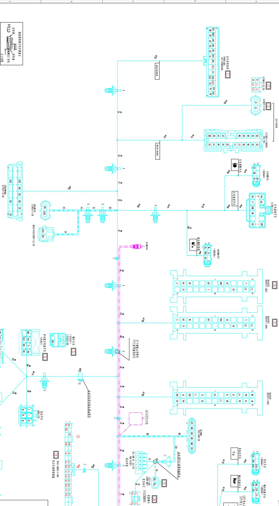

<table><tr><td rowspan="2">配置参数</td><td colspan="10">连接器特性编码</td></tr><tr><td>C1</td><td>C2</td><td>C3</td><td>C4</td><td>C5</td><td>C6</td><td>C7</td><td>C8</td><td>C9</td><td>C10</td></tr><tr><td>发动机</td><td>大屏</td><td>长路5号</td><td>长路1000号</td><td>长路1000号</td><td>长路1000号</td><td>长路1000号</td><td>长路1000号</td><td>长路1000号</td><td>长路1000号</td><td>长路1000号</td></tr><tr><td>发动机、LDL开始最多为功能方向箱、全浮/固定资产驾驶室、普通前标志、无VCU</td><td>Y</td><td>N</td><td>N</td><td>Y</td><td>N</td><td>N</td><td>N</td><td>N</td><td>N</td><td>N</td></tr><tr><td>载音机、LDL开始最多为功能方向箱、全浮/固定资产驾驶室、发射前标志、无VCU</td><td>Y</td><td>N</td><td>N</td><td>Y</td><td>N</td><td>N</td><td>N</td><td>N</td><td>N</td><td>N</td></tr><tr><td>载音机、LDL开始最多为功能方向箱、全浮/固定资产驾驶室、发射前标志、无VCU</td><td>Y</td><td>N</td><td>N</td><td>Y</td><td>N</td><td>N</td><td>N</td><td>N</td><td>N</td><td>N</td></tr><tr><td>载音机、LDL开始最多为功能方向箱、全浮/固定资产驾驶室、发射前状态、无VCU</td><td>Y</td><td>N</td><td>N</td><td>Y</td><td>N</td><td>N</td><td>N</td><td>N</td><td>N</td><td>N</td></tr><tr><td>载音机、LDL开始最多为功能方向箱、全浮/固定资产驾驶室、发射前标志、无VCU</td><td>Y</td><td>N</td><td>N</td><td>Y</td><td>N</td><td>N</td><td>N</td><td>N</td><td>N</td><td>N</td></tr><tr><td>载音机、LDL开始最多为功能方向箱、全浮/固定资产驾驶室、发射前标志、天VCU</td><td>Y</td><td>N</td><td>N</td><td>Y</td><td>N</td><td>N</td><td>N</td><td>N</td><td>N</td><td>N</td></tr><tr><td>载音机、LDL开始最多为功能方向箱、全浮/固定资产驾驶室、发射前标志、天VCU</td><td>Y</td><td>N</td><td>N</td><td>Y</td><td>N</td><td>N</td><td>N</td><td>N</td><td>N</td><td>N</td></tr><tr><td>载音机、LDL开始最多为功能方向箱、全浮/固定资产驾驶室、发射前标志、天VCUL</td><td>Y</td><td>N</td><td>N</td><td>Y</td><td>N</td><td>N</td><td>N</td><td>N</td><td>N</td><td>N</td></tr><tr><td>载音机、LDL开始最多为功能方向箱、全浮/固定资产驾驶室、发射前标志、天VCUL</td><td>Y</td><td>N</td><td>N</td><td>Y</td><td>N</td><td>N</td><td>N</td><td>N</td><td>N</td><td>N</td></tr><tr><td>载音机、LDL开始最多为功能方向箱、全浮/固定资产驾驶室、发射前标志、天VCUL</td><td>y</td><td></td><td></td><td></td><td></td><td></td><td></td><td></td><td></td><td></td></tr></table>

连接关系列表（有1.0EOM，无智能前摄像头、无AEBS、无AMT）

<table><tr><td rowspan="2">乙酰亚替数</td><td colspan="7">铝连接特性标注编号</td></tr><tr><td>C19</td><td>C20</td><td>C21</td><td>C22</td><td>C23</td><td>C24</td><td>C25</td></tr><tr><td>苯丙烷基酸酯、醋酸酯、氯化铵等离子左丁、右车门、长尾、大屏</td><td></td><td></td><td></td><td></td><td></td><td></td><td></td></tr><tr><td></td><td></td><td></td><td></td><td></td><td>RSV</td><td></td><td></td></tr><tr><td></td><td></td><td></td><td></td><td></td><td>RSG</td><td></td><td></td></tr><tr><td></td><td></td><td></td><td></td><td></td><td></td><td></td><td></td></tr><tr><td></td><td></td><td></td><td></td><td></td><td></td><td></td><td></td></tr><tr><td></td><td></td><td></td><td></td><td></td><td></td><td></td><td></td></tr><tr><td></td><td></td><td></td><td></td><td></td><td></td><td></td><td></td></tr><tr><td></td><td></td><td></td><td></td><td></td><td></td><td></td><td></td></tr></table>

<table><tr><td colspan="9">插座警告特征编号</td></tr><tr><td rowspan="13">配置参数</td><td>67</td><td>C11/C12</td><td>C15</td><td>C16</td><td>C17</td><td>C18</td><td></td><td></td></tr><tr><td>左车号</td><td>厨套</td><td>厨房(柜)</td><td>厨房(桌)</td><td>仪表</td><td>仪表</td><td></td><td></td></tr><tr><td>603</td><td>603</td><td>711</td><td>711</td><td>72</td><td>72</td><td>72</td><td></td></tr><tr><td>84W</td><td></td><td>712</td><td>712</td><td></td><td>75</td><td></td><td>75</td></tr><tr><td></td><td></td><td></td><td></td><td></td><td></td><td></td><td></td></tr><tr><td></td><td></td><td></td><td></td><td></td><td></td><td></td><td></td></tr><tr><td></td><td></td><td></td><td></td><td></td><td></td><td></td><td></td></tr><tr><td></td><td></td><td></td><td></td><td></td><td></td><td></td><td></td></tr><tr><td></td><td></td><td></td><td></td><td></td><td></td><td></td><td></td></tr><tr><td>普通载(右棱立暖风 400L/800L 单档油箱)、无vCU</td><td>N</td><td>N</td><td>N</td><td>N</td><td>N</td><td>N</td><td>N</td></tr><tr><td>左为鼓(右棱立暖风 400L/800L 双腔油箱)、无vCU</td><td>Y</td><td>Y</td><td>Y</td><td>Y</td><td>N</td><td>Y</td><td>N</td></tr><tr><td>南方地区左为鼓(右棱立暖风 400L/800L 单档油箱)、无vCU</td><td>Y</td><td>Y</td><td>N</td><td>N</td><td>Y</td><td>N</td><td>Y</td></tr><tr><td>左为鼓(右棱立暖风 400L/800L 双腔油箱)、无vCU</td><td>Y</td><td>Y</td><td>Y</td><td>Y</td><td>N</td><td>Y</td><td>N</td></tr></table>

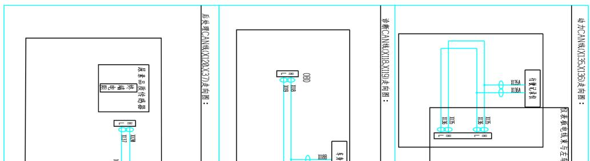

flowchart

```mermaid
graph TD
    A["输入"] --> B["120A"]
    B --> C["20A"]
    C --> D["30A"]
    D --> E["40A"]
    E --> F["50A"]
    F --> G["60A"]
    G --> H["70A"]
    H --> I["80A"]
    I --> J["90A"]
    J --> K["100A"]
    K --> L["110A"]
    L --> M["120A"]
    M --> N["输出"]
    
    subgraph Power Source
        O["输入信号"]
        P["输入输出信号"]
    end
    
    subgraph Current Source
        Q["输入信号"]
        R["输入输出信号"]
    end
    
    subgraph Switches
        S["输入信号"]
        T["输入输出信号"]
    end
    
    subgraph Output
        U["输出信号"]
        V["输入信号"]
        W["输入输出信号"]
    end
    
    Note: The input and output signals are labeled as '以系统和线束与左右' (Output to the left). The output is labeled as '以系统和线束与左右'.
```

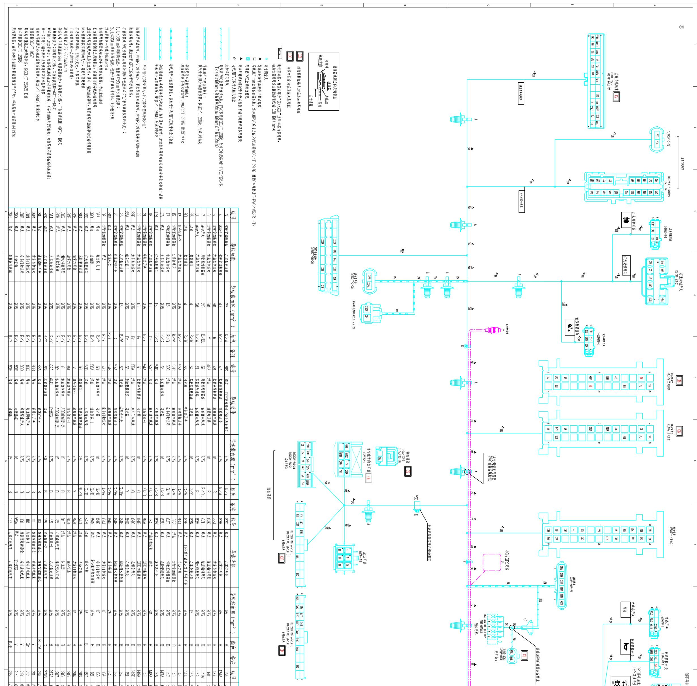

text_image

Technical schematic diagram with labeled components, wiring, and a central schematic of a system or control unit.

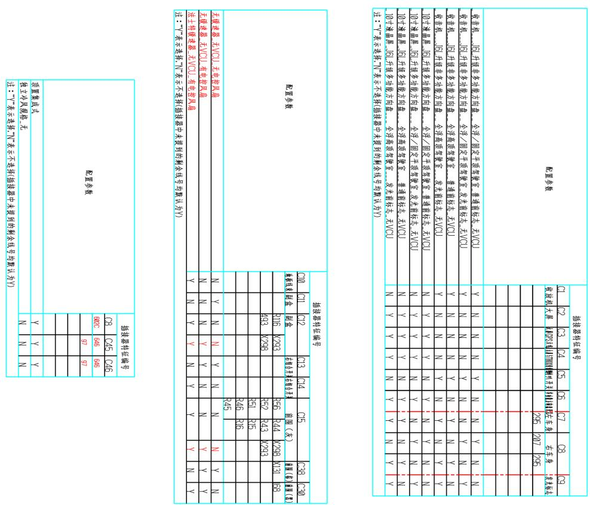  
选装关系列表（无BCM\_无智能前摄像头无AERS\_\_无AMT）

<table><tr><td rowspan="51" colspan="9">配置参数
配置器特征编号</td></tr><tr></tr><tr></tr><tr></tr><tr></tr><tr></tr><tr></tr><tr></tr><tr></tr><tr></tr><tr></tr><tr><td></td></tr><tr><td></td></tr><tr><td></td></tr><tr><td></td></tr><tr><td></td></tr><tr><td></td><td></td></tr><tr><td></td><td></td></tr><tr><td></td><td></td><td></td></tr><tr><td></td><td></td><td></td></tr><tr><td></td><td></td><td></td><td></td></tr><tr><td></td><td></td><td></td><td></td></tr><tr><td></td><td></td><td></td><td></td></tr><tr><td></td><td></td><td></td><td></td><td></td></tr><tr><td></td><td></td><td></td><td></td><td></td></tr><tr><td></td><td></td><td></td><td></td><td></td></tr><tr><td></td><td></td><td></td><td></td><td></td><td></td></tr><tr><td></td><td></td><td></td><td></td><td></td><td></td></tr><tr><td></td><td></td><td></td><td></td><td></td><td></td></tr><tr><td></td><td></td><td></td><td></td><td></td><td></td></tr><tr><td></td><td></td><td></td><td></td><td></td><td></td></tr><tr><td></td><td></td><td></td><td></td><td></td><td></td></tr><tr><td></td><td></td><td></td><td></td><td></td><td></td></tr><tr><td></td><td></td><td></td><td></td><td></td><td></td></tr><tr><td></td><td></td><td></td><td></td><td></td><td></td></tr><tr><td></td><td></td><td></td><td></td><td></td><td></td></tr><tr><td></td><td></td><td></td><td></td><td></td><td></td></tr><tr><td></td><td></td><td></td><td></td><td></td><td></td></tr><tr><td></td><td></td><td></td><td></td><td></td><td></td></tr><tr><td></td><td></td><td></td><td></td><td></td><td></td></tr><tr><td></td><td></td><td></td><td></td><td></td><td></td></tr><tr><td></td><td></td><td></td><td></td><td></td><td></td></tr><tr><td></td><td></td><td></td><td></td><td></td><td></td></tr><tr><td></td><td></td><td></td><td></td><td></td><td></td></tr><tr><td></td><td></td><td></td><td></td><td></td><td></td></tr><tr><td></td><td></td><td></td><td></td><td></td><td></td></tr><tr><td></td><td></td><td></td><td></td><td></td><td></td></tr><tr><td></td><td></td><td></td><td></td><td></td><td></td></tr><tr><td></td><td></td><td></td><td></td><td></td><td></td></tr><tr><td></td><td></td><td></td><td></td><td></td><td></td></tr><tr><td></td><td></td><td></td><td></td><td></td><td></td></tr></table>

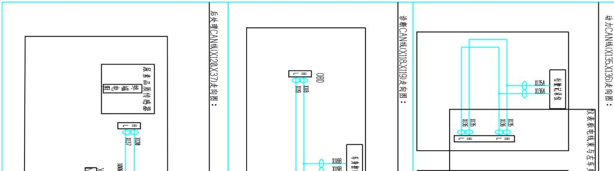

text_image

后处理C/N线(X20X27)走向图：
诊断CAN线(X18X19)走向图：
实为CAN线(X35X30)走向图：
电源新电机与左车角
电源型号：V154
电源型号：V156
电源型号：V155
电源型号：V156
电源型号：V157
电源型号：V158
电源型号：V159
电源型号：V160
电源型号：V161
电源型号：V162
电源型号：V163
电源型号：V164
电源型号：V165
电源型号：V166
电源型号：V167
电源型号：V168
电源型号：V169
电源型号：V170
电源型号：V171
电源型号：V172
电源型号：V173
电源型号：V174
电源型号：V175
电源型号：V176
电源型号：V177
电源型号：V178
电源型号：V179
电源型号：V180

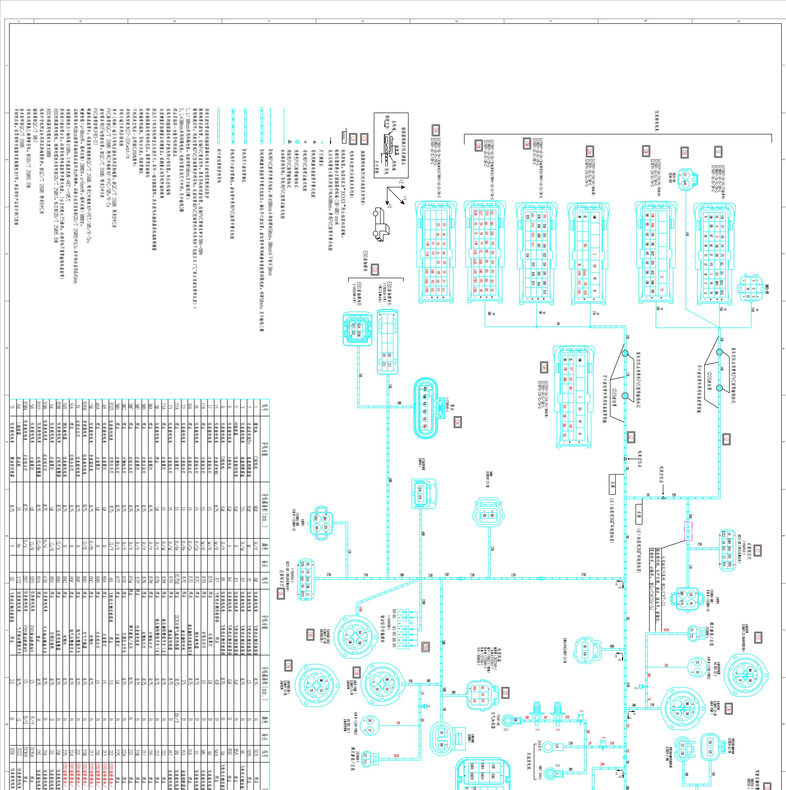

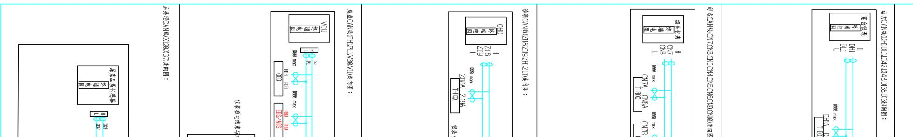

text_image

后处理CAN线(X20X37)走向图：
VCC
1000 max
PHG
PLB
ORD
PHL
EBS/ABS
负表板电线采样
底盘CAN线(PHLPLY38AVID)走向图：
Z18 H
219
1000 max
Z19A
T-80X
仪表板
诊断CAN线(Z18Z19S2H2LD)走向图：
铝/铁表
CN7
1000 max
CN8
1000 max
CN7A
CN6A
CN7B
T-80X
铅笔CAN线CN7CN8CN3CN4CN5CN6CN6CN6DNID走向图：
动力CAN线(OHDLI042043D135D136)向图：
熔合板
熔点
熔点
熔点
熔点
熔点
熔点
熔点
熔点
熔点
熔点
熔点
熔点
熔点
熔点
熔点
熔点
熔点
熔点
熔点
熔点
熔点
熔点
熔点
熔点
熔点
熔点
熔点
熔点
熔点
熔点
熔点
熔点
熔点
熔点

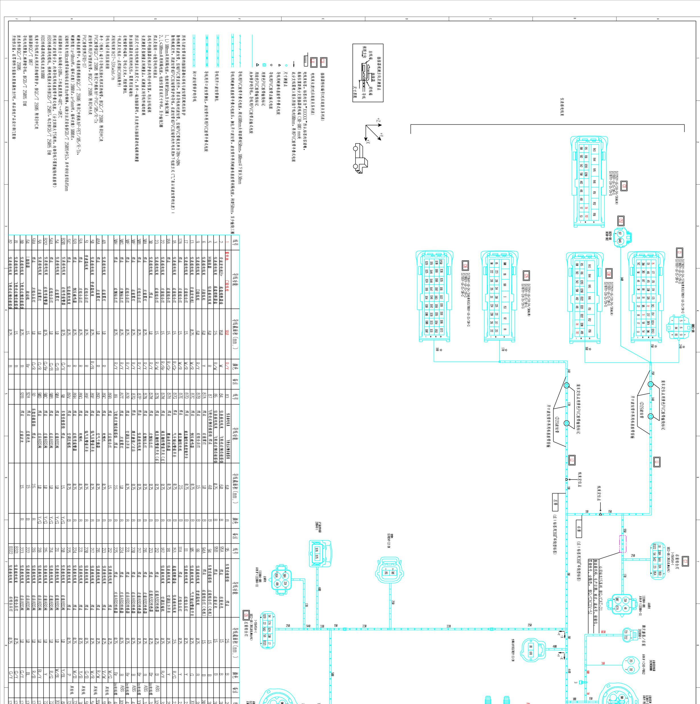

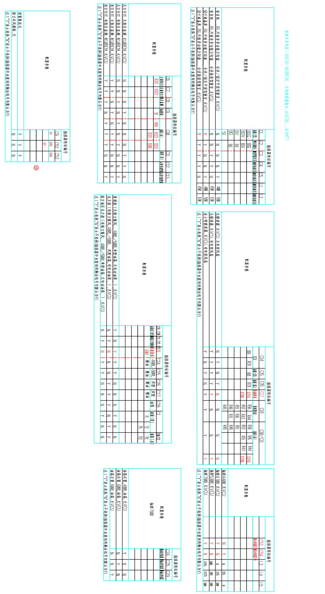

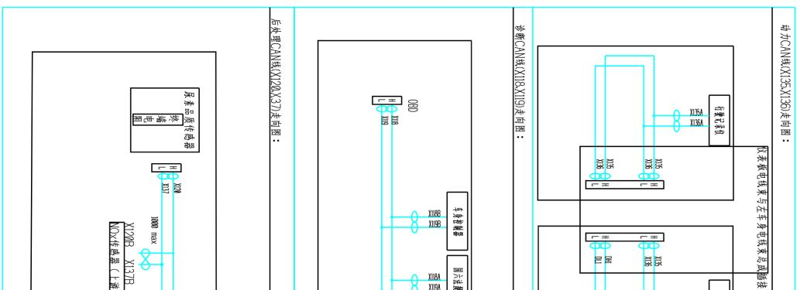

text_image

动力CAN线(X135-X190)走向图：
后处理CAN线(X120X137)走向图：
动力CAN线(X183X190)走向图：
车车身精密
图六点连接
仪表电机系与左车身电线架连接法
仪表电机系与右车身电气连接法
车车身精密
图六点连接
仪表电机系与左车身电气连接法
仪表电机系与右车身电气连接法

<table><tr><td>提前准备</td></tr><tr><td>10</td></tr></table>

<table><tr><td>名称</td><td colspan="9">芯虎蓝电线电缆配置总成</td><td>3724265-22P</td></tr><tr><td>设计</td><td colspan="2">周金山</td><td>桥梁间距</td><td>垂直</td><td colspan="2">长×150</td><td colspan="2">横向高×10</td><td>横向高×10</td><td>未有重量为重</td></tr><tr><td>校对</td><td colspan="2">范珂振</td><td>护边跨径</td><td>M</td><td>垂直</td><td>长×150</td><td colspan="2">腰高×10</td><td>腹板</td><td>未有重量为重</td></tr><tr><td>管路</td><td colspan="2">李仲鹏</td><td>垂直</td><td>85.5kg</td><td>底板厚</td><td>M</td><td colspan="2">腰高×10</td><td>底板</td><td>未有重量为重</td></tr><tr><td colspan="2">总布直径</td><td colspan="6">田须</td><td>螺栓规格</td><td>C/CHTA W5</td><td></td></tr><tr><td>标准差</td><td colspan="7">王伟</td><td>支座螺栓型号</td><td>CA1H1R5K3CLAHQ6GQ00707-04</td><td></td></tr><tr><td colspan="8">合容</td><td>支座</td><td>CZ 标尺(GB/T 1) 1 号圈</td><td>2021/12/4</td></tr><tr><td>批进</td><td colspan="2">李国辉</td><td colspan="5">材质</td><td colspan="3">一汽解放汽车有限公司商用车开发院</td></tr><tr><td colspan="8">11</td><td colspan="3">12</td></tr></table>

<table><tr><td></td><td>21</td></tr></table>

<table><tr><td>提前准备</td></tr><tr><td>22</td></tr></table>

<table><tr><td>名称</td><td colspan="9">芯座曲线及配套组合总成</td></tr><tr><td>设计</td><td>周金山</td><td>桥梁模型</td><td>弹簧</td><td>车床35#</td><td>钢轨卧车</td><td>挖掘机</td><td>C</td><td>圆锥</td><td>AMX4</td></tr><tr><td>校对</td><td>范河坝振</td><td>平面调整</td><td>M</td><td>毛架</td><td>圆孔</td><td>圆柱结构</td><td></td><td>松树</td><td></td></tr><tr><td>管径</td><td>李仲朝</td><td>重量</td><td>16.5</td><td>kg</td><td>底板厚</td><td>M</td><td>圆柱护脚</td><td>M</td><td></td></tr><tr><td>总布置直径</td><td>田硕</td><td></td><td></td><td></td><td></td><td></td><td>螺栓规格</td><td>C/TTA-V5</td><td></td></tr><tr><td>标高克</td><td>王伟</td><td></td><td></td><td></td><td></td><td></td><td>支撑螺栓</td><td>CA181BPSER1CA08ECQ09D70.04</td><td></td></tr><tr><td>点名</td><td></td><td></td><td></td><td></td><td></td><td></td><td>主轴</td><td>G2</td><td>桩长(1)轴长 1</td></tr><tr><td>批提</td><td>李国辉</td><td>材料</td><td></td><td></td><td></td><td></td><td colspan="3">一汽解放汽车有限公司商用车开发院</td></tr><tr><td colspan="7">23</td><td colspan="3">24</td></tr></table>

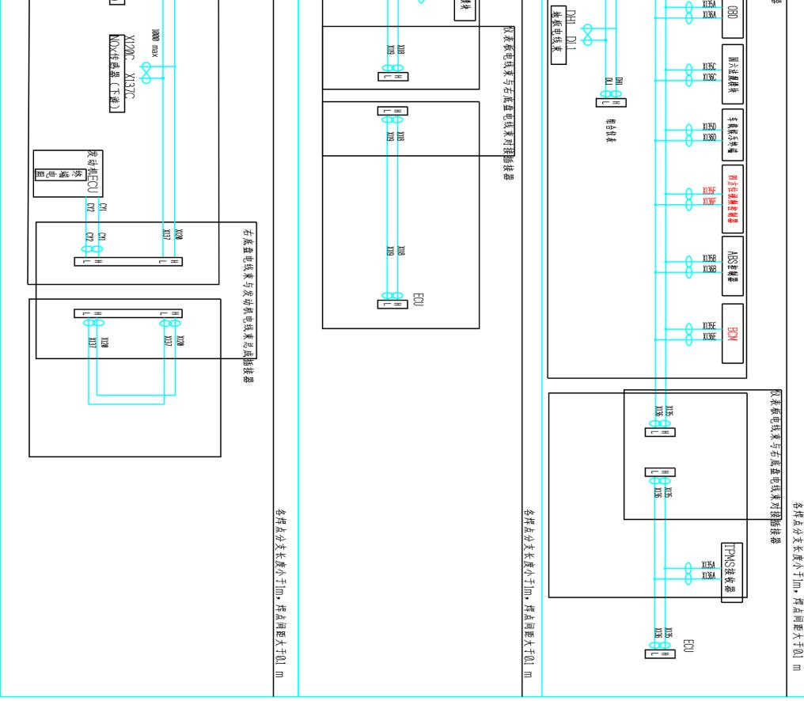

flowchart

```mermaid
graph TD
    A["电磁线"] --> B["输入连接器"]
    B --> C["导线名称"]
    C --> D["与电磁线连接器"]
    D --> E["RS控制器"]
    E --> F["ROM"]
    F --> G["TPNS转换器"]
    G --> H["ECU"]
    H --> I["PCB"]
    I --> J["PPNS转换器"]
    J --> K["PCB"]
    K --> L["PPNS转换器"]
    L --> M["PCB"]
    M --> N["PPNS转换器"]
    N --> O["PCB"]
    O --> P["PPNS转换器"]
    P --> Q["PCB"]
    Q --> R["PPNS转换器"]
    R --> S["PCB"]
    S --> T["PPNS转换器"]
    T --> U["PCB"]
    U --> V["PPNS转换器"]
    V --> W["PCB"]
    W --> X["PPNS转换器"]
    X --> Y["PCB"]
    Y --> Z["PPNS转换器"]
    Z --> AA["PCB"]
    AA --> AB["PPNS转换器"]
    AB --> AC["PCB"]
    AC --> AD["PPNS转换器"]
    AD --> AE["PCB"]
    AE --> AF["PPNS转换器"]
    AF --> AG["PCB"]
```

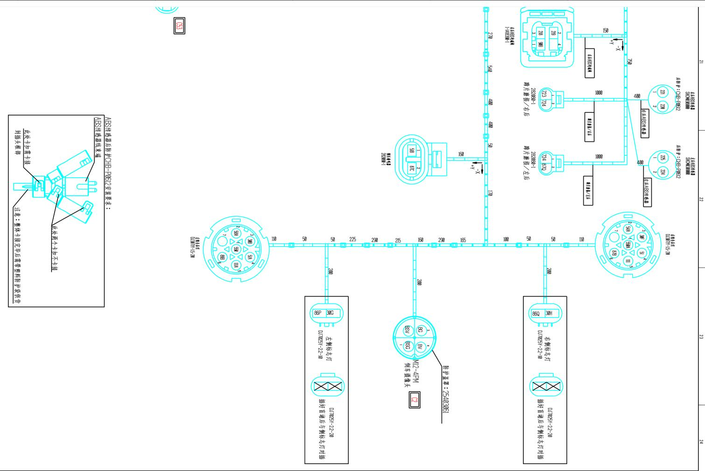

text_image

ABS转换器后保护CHB-P0512安装要求：
ABS传感器线束端
连接：基体卡接完毕后带塑料防护板供给
连接：主轴大尺寸不小于连接
连接：主轴大尺寸大于连接
连接：主轴大尺寸大于连接
连接：主轴大尺寸大于连接
连接：主轴大尺寸大于连接
连接：主轴大尺寸大于连接
连接：主轴大尺寸大于连接
连接：主轴大尺寸大于连接
连接：主轴大尺寸大于连接
连接：主轴大尺寸大于连接
连接：主轴大尺寸大于连接
连接：主轴大尺寸大于连接
连接：主轴大尺寸大于链接
连接：主轴大尺寸大于链接
连接：主轴大尺寸大于链接
连接：主轴大尺寸大于链接
连接：主轴大尺寸大于链接
连接：主轴大尺寸大于链接
连接：主轴大尺寸大于链接
连接：主轴大尺寸大于链接
连接：主轴大尺寸大于链接
连接：主轴大尺寸大于链接
连接：主轴大尺寸大于链接
连接：主轴大尺寸大于链接

